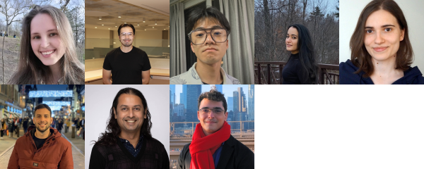

::: column-margin
**Actualités**

**Janv 2023** - Si vous avez des compétences en programmation, êtes intéressé.e par un stage d'été rémunéré (juin-juillet-août) et êtes relativement nouveau dans le monde du logiciel libre, contactez-nous - nous pourrions avoir 2 projets ou plus disponibles dans le cadre du programme Google Summer of Code.

**Janv 2023** - Yohaï-Eliel et Oren reçoivent chacun une bourse de recrutement VHRN. Félicitations à tous les deux !

**Janv 2023** - Kasia a reçu une bourse d'excellence postdoctorale UNIQUE !

**Janv 2023** - Yohai et Oren rejoignent le laboratoire en tant que nouveaux étudiants en MSc ; Anais commence son cours de recherche de premier cycle au laboratoire. Bienvenue !

**Nov 2022** - Amanda et Kasia présentent le premier poster du laboratoire lors de la réunion VHRN à Montréal.

{fig-alt="Logo du laboratoire"}
:::

Nous travaillons à l'interface entre la cognition, le cerveau, les machines et le monde extérieur, en utilisant des mesures comportementales (parmi lesquelles l'oculométrie), des mesures physiologiques et des modèles computationnels. Nous travaillons avec des humains (et bientôt avec des animaux, y compris des primates non-humains) ainsi qu'avec des ensembles de données libres d'accès. Une grande partie de notre recherche se concentre sur la vision, l'ouïe et les mouvements des yeux, en considérant des aspects sensoriels, attentionnels et cognitifs. Nous gardons un œil attentif sur les applications directes à la technique, aux algorithmes et à la santé humaine.

Plus de détails sur la page [Projets](projects.qmd).

[{fig-alt="Membres du laboratoire" fig-align=left}](members.qmd)
