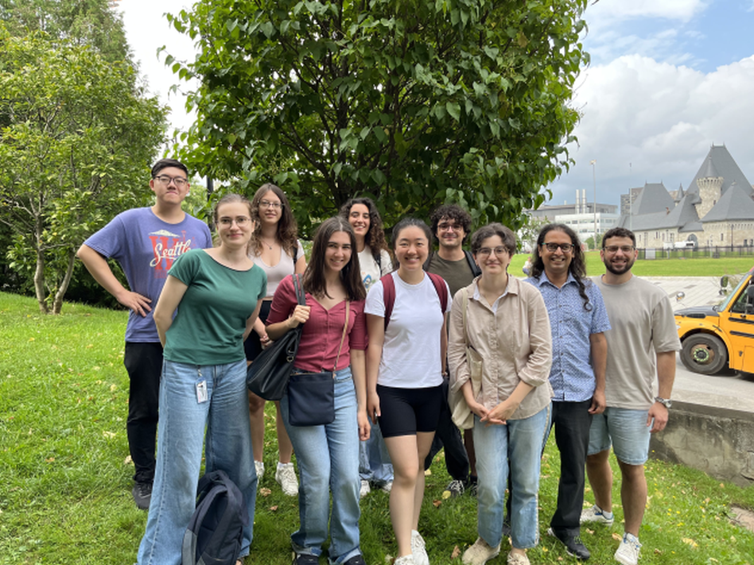

Nous travaillons à l'interface entre la cognition, le cerveau, les machines et le monde extérieur, en utilisant des mesures comportementales (parmi lesquelles l'oculométrie), des mesures physiologiques et des modèles computationnels. Nous travaillons avec des humains (et bientôt avec des animaux, y compris des primates non-humains) ainsi qu'avec des ensembles de données libres d'accès. Une grande partie de notre recherche se concentre sur la vision, l'ouïe et les mouvements des yeux, en considérant des aspects sensoriels, attentionnels et cognitifs. Nous gardons un œil attentif sur les applications directes à la technique, aux algorithmes et à la santé humaine.

Plus de détails sur la page [Projets](projects.qmd).

[{fig-alt="Membres du laboratoire" fig-align=left}](members.qmd)

[Plus de photos](https://m2b3.github.io/members.html#us)

<!-- to make a contact sheet, set boundaries in irfanview thumbnails -->

**Actualités**

**Septembre 2023** - Plus de [prépublications](output.qmd) publiées ! Félicitations Yohai. 📄

**Septembre 2023** - Noa reçoit une bourse de recrutement RRSV. Félicitations Noa ! 🏆

**Septembre 2023** - Bienvenue à Noa (Masters), Alexandru et Lilia (NSCI 410), Youzhi (PSYC 494), Romina (COGS 401) et Divi (PSYC 396) au laboratoire :wave:

**Août 2023** -  La première série de [prépublications](output.qmd) du laboratoire est disponible ! Félicitations, Kasia et Buxin. 📄

**Août 2023** - Oren a remporté la bourse commémorative Jenny Panitch Beckow (20 000 CAD) pour son projet concernant l'absorption musicale. Félicitations Oren. 🏆

**Juillet 2023** - Yohaï et son équipe [ont décroché la victoire au AI Safety Hackathon](https://www.linkedin.com/posts/entrepreneur-first_last-night-marked-the-conclusion-of-our-ai-activity-7084967819297087488-b-DN?utm_source=share&utm_medium=member_desktop) organisé par Meta AI et Entrepreneur First aux bureaux parisiens de Meta. 🏆

**Juin 2023** - Alexandru, Bradley, Yavuz, Lilia et Youzhi rejoignent le laboratoire en tant que stagiaires d'été. Alexandru et Youzhi suivront ensuite les cours NSCI 410 et PSYC 494 respectivement avec nous pendant deux semestres. :wave:

**Mai 2023** - Kasia reçoit un prix de présentation scientifique et de formation de la part du RRSV. 🏆

**Mars 2023** - L'équipe composée d'Anais, d'Amanda, de Yohai et d'Ula a reçu une bourse d'études du CIRMMT pour travailler sur leur projet de performance musicale. 🏆

**Janv 2023** - Si vous avez des compétences en programmation, êtes intéressé.e par un stage d'été rémunéré (juin-juillet-août) et êtes relativement nouveau dans le monde du logiciel libre, contactez-nous - nous pourrions avoir 2 projets ou plus disponibles dans le cadre du programme [Google Summer of Code](projects.qmd){#google-summer-of-code-2023}.

**Janv 2023** - Yohaï-Eliel et Oren reçoivent chacun une bourse de recrutement RRSV. Félicitations à tous les deux ! 🏆

**Janv 2023** - Kasia a reçu une bourse d'excellence postdoctorale UNIQUE ! 🏆

**Janv 2023** - Yohai et Oren rejoignent le laboratoire en tant que nouveaux étudiants en MSc ; Anais commence son cours de recherche de premier cycle au laboratoire. Bienvenue ! :wave:

**Nov 2022** - Amanda et Kasia présentent le premier poster du laboratoire lors de la réunion RRSV à Montréal. 🏆

{fig-alt="Logo du laboratoire"}

-------------------------------

