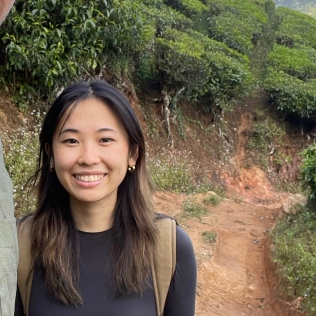
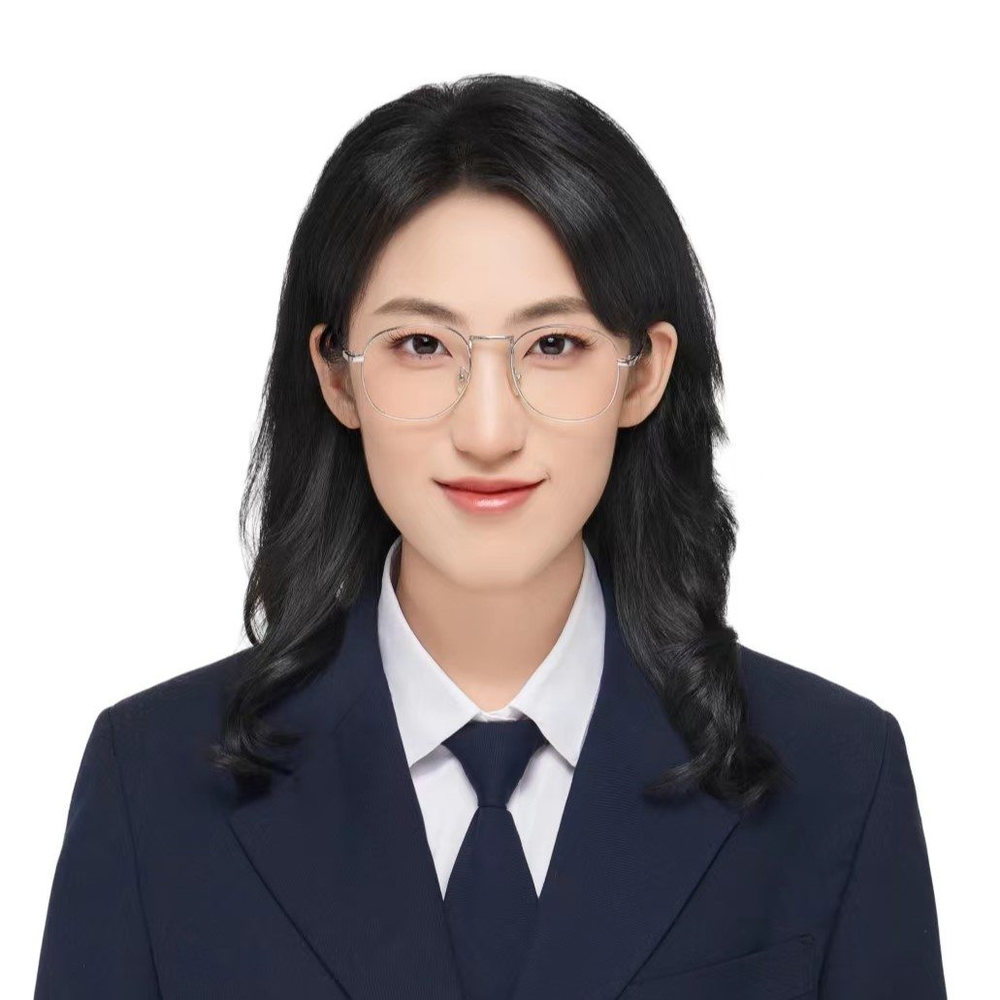
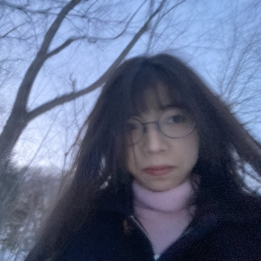
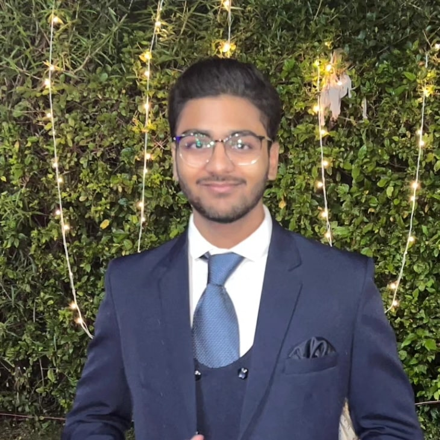

---
title: "Membres"
description: |
lang: fr  

output:
  distill::distill_article:
    self_contained: false
    toc: true
    toc_depth: 3

execute:
  echo: false
  freeze: auto
knitr:
  opts_chunk: 
    collapse: true
    results: false
    warnings: false
---

### Membres actuels du laboratoire

<!--
::: column-margin
L’image de Marty est tirée du [McGill Tribune](https://tinyurl.com/55wf3bae).
:::
-->

::: {#members layout-ncol="6"}
[{fig-alt="Photo de Suresh Krishna"}](#suresh)

[{fig-alt="Photo de Katarzyna (Kasia) Jurewicz"}](#kasia)

[{fig-alt="Photo de Yohai-Eliel Berreby"}](#yohai)

[{fig-alt="Photo de Oren Gurevitch"}](#oren)

[{fig-alt="Photo de Noa Kemp"}](#noa)

[{fig-alt="Photo de Buxin Liao"}](#buxin)

[{fig-alt="Photo de Maya Aderka"}](#maya)

[{fig-alt="Photo de Jacky Chen"}](#jacky)

[{fig-alt="Photo de Alex Zhao"}](#azhao)

[{fig-alt="Photo de Anna Rose Hunt-Isaak"}](#annarose)

[{fig-alt="Photo de Yiqing Zhu"}](#Yiqing)

[{fig-alt="Photo de Edward Tong"}](#Edward)

[{fig-alt="Photo de Youyou Yang"}](#Claire)

[{fig-alt="Photo de Jonathan Morris"}](#Jonathan)

[{fig-alt="Photo de Deepansh Goel"}](#Deepansh)

[{fig-alt="Photo de Alison Jiaxi Wang"}](#Alison)


:::

### Collaborateurs

::: {#collaborators  layout-ncol="5"}
[{fig-alt="Photo de Chris"}](https://www.mcgill.ca/neuro/christopher-pack-phd)

[{fig-alt="Photo de Emmanuel"}](https://www.janelia.org/people/ifedayo-emmanuel-adeyefa-olasupo)

[{fig-alt="Photo de Catherine"}](https://www.mcgill.ca/sis/people/faculty/guastavino)

[{fig-alt="Photo de Fabrice"}](https://www.mcgill.ca/music/fabrice-marandola)

[{fig-alt="Photo de Simone"}](https://brams.org/members/simone-dalla-bella/)

[{fig-alt="Photo de Audrey"}](https://audur2.ift.ulaval.ca/)

[{fig-alt="Photo de Dang Nguyen"}](https://neurosciences.umontreal.ca/recherche/les-chercheurs/dang-khoa-nguyen/)

[{fig-alt="Photo de Marcelo"}](https://www.mcgill.ca/music/marcelo-m-wanderley)

[{fig-alt="Photo de MH"}](https://www.mcgill.ca/spot/marie-helene-boudrias)

[{fig-alt="Photo de Joshua"}](https://www.linkedin.com/in/joshua-rosner-98b15b166/?originalSubdomain=ca)

::: 

------------------------------------------------------------------------

<a name="suresh"></a>

#### Suresh Krishna

::: column-margin
{fig-alt="Photo de Suresh Krishna" width="200"}
:::

-   Professeur agrégé, Départment de Physiologie, McGill.

-   MBBS (École de Médecine), AIIMS, New Delhi; Doctorat, NYU, New York.

-   A passé du temps à l'Université Columbia, au CNRS (Lyon), au Centre Allemand de Primates (Goettingen), à l'Institut Max-Planck de Développement Humain (Berlin), avant de venir à McGill (janvier 2020).

-   [Email](mailto:suresh.krishna@mcgill.ca); [Google Scholar]( Google Scholar - https://tinyurl.com/ypeu5ha3)

------------------------------------------------------------------------

<a name="kasia"></a>

#### Katarzyna (Kasia) Jurewicz

::: column-margin
{fig-alt="Photo de Katarzyna (Kasia) Jurewicz" width="200"}
:::

-   Boursière Post-Doctorale, Département de Physiologie, McGill.

-   Maîtrise en Psychologie, Université de Varsovie ; Doctorat en Neurobiologie, Institut Nencki de Biologie Expérimentale, Académie Polonaise des Sciences, Varsovie.

-   Auparavant, j'étais post-doc dans le laboratoire du Dr Becket Ebitz (Laboratoire de recherche sur le bruit) à l'Université de Montréal. Précédemment, j'ai mené des recherches dans le groupe cortico-thalamique du Dr Ewa Kublik à l'Institut Nencki de biologie expérimentale. Mon travail de doctorat a été supervisé par le professeur Andrzej Wróbel au Laboratoire du Système Visuel de Nencki.

-   [Email](mailto:katarzyna.jurewicz@mail.mcgill.ca); [Google Scholar]( http://www.tinyurl.com/kjurewicz-scholar)

------------------------------------------------------------------------

<a name="yohai"></a>

#### Yohai-Eliel Berreby

::: column-margin
{fig-alt="Photo de Yohai-Eliel Berreby" width="200"}
:::

-   Étudiant à la Maîtrise, Département de Physiologie, McGill

-   Diplôme d'Ingénieur (B. Sc. et M. Sc. combinés en ingénierie), Télécom Paris, Palaiseau, France

-   MPSI/MP CPGE (Math/Physique [*Classes Préparatoires aux Grandes Écoles*](https://en.wikipedia.org/wiki/Classe_pr%C3%A9paratoire_aux_grandes_%C3%A9coles)), Lycée Hoche, Versailles, France

-   [Email](mailto:yohai-eliel.berreby@mail.mcgill.ca); [GitHub]( https://github.com/yberreby/); [LinkedIn]( https://linkedin.com/in/yberreby)

------------------------------------------------------------------------

<a name="oren"></a>

#### Oren Gurevitch

::: column-margin
{fig-alt="Photo de Oren Gurevitch" width="200"}
:::

-   Étudiant à la Maîtrise, Département de Physiologie, McGill.

-   B. Sc. en Neuroscience, Université Bar-Ilan, Ramat Gan, Israel.

-   Précédemment, j'étais assistant de recherche sur le traitement sensoriel chez les rats, à l'Université Bar-Ilan, sous la direction du professeur Adam Zaidel. Avant cela, en tant qu'assistant de laboratoire à l'Institut Weizmann des Sciences, j'ai travaillé sur la recherche sur la sclérose en plaques avec le professeur Idit Shachar.

-   [Email](mailto:oren.gurevitch@mail.mcgill.ca); [GitHub]( https://github.com/OrenGurevitch); [LinkedIn]( https://www.linkedin.com/in/oren-gurevitch/)

------------------------------------------------------------------------

<a name="noa"></a>

#### Noa Kemp

::: column-margin
{fig-alt="Photo de Noa Kemp" width="200"}
:::

-   Étudiante à la Maîtrise, Département de Physiologie, McGill.

-   Baccalauréat complété à McGill en Biologie et Informatique.

-   Entre la comédie musicale, l’informatique et le cerveau - je suis incapable de choisir, alors je compte étudier une de leur intersection: l'espace audiovisuel et la perception d'objets.

-   J'ai vécu toute mon enfance en Belgique, mais la moitié de ma famille est en Israël et j’y ai passé la plupart de mes étés. Aujourd’hui, là où je me sens le plus chez-moi est clairement Montréal.

-   [Email](mailto:noa.kemp@mail.mcgill.ca)

------------------------------------------------------------------------

<a name="buxin"></a>

#### Buxin Liao

::: column-margin
{fig-alt="Photo de Buxin Liao" width="200"}
:::

-   Étudiant à la Maîtrise, Programme Intégré en Neurosciences (PIN), McGill.

-   Étudiant à la Maîtrise en Ingénierie, Génie Biomédical, Université des Sciences et Technologies Électroniques de Chine, Chengdu, Chine.

-   B. Ing. en Génie Biomédical, Université du Sud-Est, Nanjing, Chine.

-   [Email](mailto:buxin.liao@mail.mcgill.ca); [GitHub]( https://github.com/D-Fonauton)

------------------------------------------------------------------------

<a name="maya"></a>

#### Maya Aderka

::: column-margin
{fig-alt="Photo de Maya Aderka" width="200"}
:::

-   Étudiante en Maîtrise, Département de Physiologie, McGill.

-   Baccalauréat en Psychologie et Informatique avec une spécialisation en Neurosciences, Université de Tel Aviv, Tel Aviv, Israël

-   Pendant mon baccalauréat, j’ai travaillé comme assistante de recherche dans le laboratoire de Prof. Nitzan Censor, qui étudie la mémoire et l’apprentissage. J’ai conduit des études sur les sciences comportementales, ainsi que sur l’EEG, l’IRMf et la TMS.

-   Dans ma dernière année de baccalauréat, j’ai rejoint le laboratoire de sommeil du Prof. Yuval Nir pour collaborer sur la création de SleepEEGpy, une plateforme pour pré-traiter et analyser les données de l'EEG du sommeil.

-   [Email](mailto:maya.aderka@mail.mcgill.ca); [GitHub]( https://github.com/maya-a); [LinkedIn]( https://www.linkedin.com/in/maya-aderka-703b08229/)

------------------------------------------------------------------------

<a name="jacky"></a>

#### Jacky Chen

::: column-margin
{fig-alt="Photo de Jacky Chen" width="200"}
:::

-   Étudiant en Baccalauréat de psychologie avec une double mineure en sciences comportementales et en sciences des arts, à l'Université McGill.

-   Je suis passionné de piano et je m'intéresse aux interactions entre les processus cognitifs, l'expression musicale et les variations de l'attention. Mes recherches explorent les liens entre la psychologie, la musique et les sciences cognitives.

-   Originaire de Shanghai, en Chine, j'y ai vécu jusqu'à l'âge de 18 ans avant de déménager à Montréal pour mes études à l'Université McGill. J'apprécie particulièrement les étés montréalais !

-   [Email](mailto:yijun.chen@mail.mcgill.ca)

------------------------------------------------------------------------

<a name="azhao"></a>

#### Alex Zhao

::: column-margin
{fig-alt="Photo de Alex Zhao" width="200"}
:::

-   Étudiant en Baccalauréat de neurosciences.

-   Mes études et ma recherche se concentrent sur les neurosciences computationnelles, une branche d'études qui met l'emphase sur la découverte de procès neuronaux avec l'aide de système informatiques.

-   Dans mon temps libre, je m'occupe avec la lecture en plus du voyage.

-   [Email](mailto:alex.zhao@mail.mcgill.ca)

------------------------------------------------------------------------

<a name="annarose"></a>

#### Anna Rose Hunt-Isaak

::: column-margin
{fig-alt="Photo de Anna Rose Hunt-Isaak" width="200"}
:::

-   Je m'intéresse aux points communs entre les neurosciences et l'informatique, en particulier à la manière dont nous pouvons modéliser informatiquement le traitement cognitif et développer une meilleure compréhension de la façon dont l'activité neuronale influence les comportements observables.

-   Mes loisirs incluent la pâtisserie, la lecture des œuvres de George Saunders, et ne pas m'habiller assez chaudement pour aller courir en hiver.

-   [Email](mailto:anna.hunt-isaak@mail.mcgill.ca)

------------------------------------------------------------------------

<a name="Yiqing"></a>

#### Yiqing Zhu

::: column-margin
{fig-alt="Photo de Yiqing Zhu" width="200"}
:::

-   J'ai obtenu mon baccalauréat en sciences (B.Sc.) spécialisé en informatique avec une mineure en statistique à l'Université McGill. Pendant mes études de premier cycle, j'ai mené des recherches interdisciplinaires à l'intersection de la biologie, des neurosciences et de l'informatique. Je poursuis actuellement des études supérieures en me concentrant sur l'apprentissage automatique, l'intelligence artificielle et la contribution des grands modèles de langage à la recherche sur les données.

-   [Email](mailto:yiqing.zhu2@mail.mcgill.ca)

------------------------------------------------------------------------

<a name="Edward"></a>

#### Edward Tong

::: column-margin
{fig-alt="Photo de Edward Tong" width="200"}
:::

-   Mes cours en bioingénierie se concentrent souvent sur les element de conception comme en ingénierie tissulaire ou dispositifs microfluidiques. Cependant, mon intérêt a été éveillé lors d'un cours en analyse de signaux (BIEN462) lorsque j'apprenais sur les capacités diagnostiques des ECG. J'ai hâte d'analyser d'autres signaux, comme les EGG. Pendant mon temps libre, j'aime écouter de la musique et jouer à des jeux vidéo.

-   [Email](mailto:edward.tong@mail.mcgill.ca)

------------------------------------------------------------------------

<a name="Claire"></a>

#### Youyou Yang

::: column-margin
{fig-alt="Photo de Youyou Yang" width="200"}
:::

-   Étudiante à la maîtrise en informatique, McGill.

-   Titulaire d’un baccalauréat en physique et informatique de McGill. J’admire le Dr Wilder Penfield et je m’intéresse actuellement à l’intelligence artificielle inspirée du cerveau.

-   [Email](mailto:youyou.yang@mail.mcgill.ca)

------------------------------------------------------------------------

<a name="Jonathan"></a>

#### Jonathan Morris

::: column-margin
{fig-alt="Photo de Jonathan Morris" width="200"}
:::

-   B.Sc. en statistiques, B.Sc. en psychologie, Université du Wisconsin–Madison

-   Je suis intéressé par l’analyse mathématique des signaux et des réseaux en neurosciences, ainsi que par leurs applications en sciences de la santé.

-   [Email](mailto:jonathan.morris@mail.mcgill.ca)

------------------------------------------------------------------------

<a name="Deepansh"></a>

#### Deepansh Goel

::: column-margin
{fig-alt="Photo de Deepansh Goel" width="200"}
:::

-   B.Tech en informatique et ingénierie, spécialisation en IA et apprentissage automatique, Maharaja Agrasen Institute of Technology, Delhi, Inde

-   Je m'intéresse à la vision par ordinateur, à l’intelligence artificielle, à la musique et à la robotique.

-   [Email](mailto:deepansh.goel@mail.mcgill.ca)

------------------------------------------------------------------------

<a name="Alison"></a>

#### Alison Jiaxi Wang

::: column-margin
{fig-alt="Photo de Alison Jiaxi Wang" width="200"}
:::

-   Étudiante en ingénierie électronique MEng, Université de Durham, Royaume-Uni (programme de maîtrise intégré avec une année à l’étranger à l’Université de Notre Dame, États-Unis).

-   A travaillé sur le projet Durham Heart, développant un prototype de cœur artificiel. Née à Taizhou, Chine, et élevée à Johor Bahru, Malaisie.

-   [Email](mailto:jiaxi.a.wang@mail.mcgill.ca)

------------------------------------------------------------------------


### D’où Venons-Nous?

<span style="color:#FF3030;">Current</span> /  <span style="color:orange;">Past</span>

```{r,message=FALSE,warning=FALSE}

library(tmap)
library(sf)

data("World")


latlist <- c(8.561259, 30.605053, 32.08233, 43.6532, 53.13333, 43.70313, 48.831704, 30.0444, 41.084148, 37.0, 45.45778, 45.56583, 50.848383801134766, 45.5019, 33.88534, 32.3274, 14.6584, 32.4279, 37.8706, 50.6, 45.25, 48.84674234948124, 31.2304, 41.9001, 31.311206, 60.29335, 45.3, 19.00437473941976, 19.1911, 30.605053, 32.119023, 30.605053, 31.9796, 46.8852, 45.5019, 33.5138, 40.022709, 45.5103643, 45.5103643, 39.9042, 45.51, 31.8775, 31.8206, 28.7041, 24.4539, 43.0722, 36.0671, 29.166128)


lonlist <- c(76.874224, 104.074123, 34.881787, -79.3832, 23.16433, 7.26608, 1.609642, 31.2357, 29.03546, 3.0, -73.88489, -73.31437, 4.350009489440508, -73.567, 35.5115, 50.865, 100.3947, 53.688, 112.5486, 3.0, 5.75, 2.3724100000000004, 121.4737, -71.0898, 75.584556, 25.03784, -73.33, 72.85023541069054, 72.856, 104.074123, 34.819675, 104.074123, 120.8937, -56.3159, -73.5674, 36.2765, -75.320869, -73.5746522, -73.5746522, -116.4074, -73.58, 120.5511, 117.2272, 77.1025, 54.3773, -89.40123, 120.3826, 120.055445)

namezlist <- c("suresh", "Haoxiang", "oren", "amanda", "kasia", "Anais", "yohai", "Injy", "Yavuz", "Lilia", "Alexandru", "Youzhi", "noa", "Bradley", "Sarah", "Pegah", "Divi", "Romina", "Sizhuo", "Lilie", "jerome", "Louis", "jacky", "alexparent", "Yagya", "lian", "azhao", "dinesh", "dhruvanshu", "buxin", "maya", "xinning", "evan", "isidore", "sabrina", "taimaa", "annarose", "Yiqing", "Yiqing", "Kevin", "Edward", "Claire", "Lihong", "Deepansh", "Rashed", "Jonathan", "Linjing", "Alison")

nowies <- is.element(namezlist, c("suresh", "oren", "kasia", "yohai", "noa", "jacky", "azhao", "buxin", "maya", "annarose", "Yiqing", "Yiqing", "Edward", "Claire", "Deepansh", "Jonathan", "Alison"))
oldies <- is.element(namezlist, c("Haoxiang", "amanda", "Anais", "Injy", "Yavuz", "Lilia", "Alexandru", "Youzhi", "Bradley", "Sarah", "Pegah", "Divi", "Romina", "Sizhuo", "Lilie", "jerome", "Louis", "alexparent", "Yagya", "lian", "dinesh", "dhruvanshu", "xinning", "evan", "isidore", "sabrina", "taimaa", "Kevin", "Lihong", "Rashed", "Linjing"))

lat<-latlist[nowies]
lon<-lonlist[nowies]

latold<-latlist[oldies]
lonold<-lonlist[oldies]


geocode <- data.frame(lon,lat)
geocode2 <- st_as_sf(geocode, coords = c("lon", "lat"), crs = 4326)

ogeocode <- data.frame(lonold,latold)
ogeocode2 <- st_as_sf(ogeocode, coords = c("lonold", "latold"), crs = 4326)

# tm_shape(World) +
#     tm_fill("lightblue",alpha=1,minimize=TRUE) +
#   tm_layout(bg.color = "black") +
# tm_shape(geocode2) +      # dots shape
#   tm_dots(col = "red", size = .2)

usesize<-1.0 #0.5

tm_shape(World)+
  tm_fill(col='darkslategray2')+
  tm_borders(col="black")+
  tm_layout(
    scale = 0.5,
    bg.color = "dodgerblue4",
    inner.margins = c(0.0005, 0.0005, 0.0005, 0.0005)  # bottom, left, top, right
  )+
  tm_shape(ogeocode2)+
  tm_dots(size = usesize, col = "orange", fill="orange")+
  tm_shape(geocode2)+
  tm_dots(size = usesize, col = "firebrick1", fill="firebrick1")+
     tm_credits("Réalisée avec tmap",
             position = c("RIGHT", "BOTTOM"))
```

### Anciens Membres

* Maîtrise 
    + Amanda Pruss (2025), IPN
    + Xinning Le (2025), IPN
	+ Haoxiang Liu (2024), IPN
	+ Buxin Liao (2024), IPN
*   PHGY 396 - Sean Solomon, Sarah Beydoun, Pegah Aghili, Jacky Chen
*   PHGY 461 - Isidore Victorri
*   COMP 401 - Nevine Nzabonimpa, Evan Jiang
*   COMP 396 - Evan Jiang
* 	COGS 401/444 - Injy Fouda, Romina Niksirat
*	PSYC 385/395 - Anais Rubsamen, Alex Parent
*   PSYC 494 - Youzhi Huang, Jacky Chen
*   NSCI 410 - Alexandru Tecu, Lilia Fernane, Alex Zhao 
*   Bourse de Recherche Mackey-Glass -- Tim Yang
*   Stage d'été McGill-EAU - Rashed Alhosani
*   Stagiaires MITACS Globalink - Linjing Wang
*   NSERC SURA - Sabrina Du
*   Stagiaires d’été – Evan Jiang, Yagya Joshi, Kevin (Yuze) Liu
*   Étudiants de 1er Cycle Observateurs - Caden Welch, Max Tweedale, Elisa Niunin, Yavuz Shahzad, Divi Maheshwari, Lilie Jeanneaux, Yagya Joshi, Bradley Austin-Keiller, Lian Mouwes
*   Stagiares (Google Summer of Code) - Dinesh Sathiaraj, Ioannis Valasakis, Prakanshul Saxena, Abhinav Venkatadri, Somnath Sharma, Jyothi Swaroop Reddy Bommareddy, Soham Mulye, Louis Martinez, Armaan Alam, Dinakar Chennupati, Dhruvanshu Joshi, Lihong Chen

--------------------------------------------------

### Nous

::: {#photos layout-ncol="2"}

{fig-alt="lab1"}

{fig-alt="lab2"}

{fig-alt="lab2"}

{fig-alt="lab2"}

{fig-alt="labgath"}

{fig-alt="labgath"}

:::
