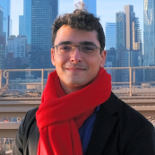
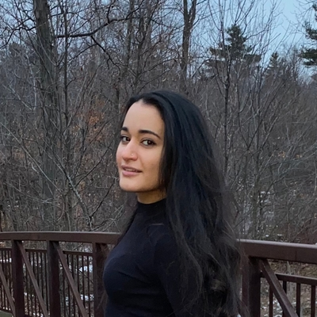
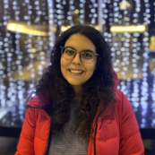

### Membres Actuels du Laboratoire

::: column-margin
L’image de Marty est tirée du [McGill Tribune](https://tinyurl.com/55wf3bae).
:::

::: {#members layout-ncol="5"}
[{fig-alt="Photo of Suresh"}](#suresh)

[{fig-alt="Photo of Kasia"}](#kasia)

[{fig-alt="Photo of Yohai"}](#yohai)

[{fig-alt="Photo of Amanda"}](#amanda)

[{fig-alt="Photo of Haoxiang"}](#haoxiang)

[{fig-alt="Photo of Oren"}](#oren)

[{fig-alt="Photo of Buxin"}](#buxin)

[{fig-alt="Photo of Anais"}](#anais)

[{fig-alt="Photo of Injy"}](#injy)

[{fig-alt="Photo of Pegah"}](#pegah)
:::

<!-- ### Étudiants de 1er Cycle Observateurs Actuels -->

<!-- ::: {layout-ncol="5"} -->


<!-- ::: -->

------------------------------------------------------------------------

<a name="suresh"></a>

#### Suresh Krishna

::: column-margin
{fig-alt="Photo of Suresh" width="200"}
:::

-   Professeur agrégé, Départment de Physiologie, McGill.

-   MBBS (École de Médecine), AIIMS, New Delhi; Doctorat, NYU, New York.

-   A passé du temps à l'Université Columbia, au CNRS (Lyon), au Centre Allemand de Primates (Goettingen), à l'Institut Max-Planck de Développement Humain (Berlin), avant de venir à McGill (janvier 2020).

-   [Courriel](mailto:suresh.krishna@mcgill.ca); Page Web Personnelle: TBA; [Google Scholar](https://tinyurl.com/48dfzjuk)

------------------------------------------------------------------------

<a name="kasia"></a>

#### Katarzyna (Kasia) Jurewicz

::: column-margin
{fig-alt="Photo of Kasia" width="200"}
:::

-   Boursière Post-Doctorale, Département de Physiologie, McGill.
-   Maîtrise en Psychologie, Université de Varsovie ; Doctorat en Neurobiologie, Institut Nencki de Biologie Expérimentale, Académie Polonaise des Sciences, Varsovie.
-   Auparavant, j'étais post-doc dans le laboratoire du Dr Becket Ebitz (Laboratoire de recherche sur le bruit) à l'Université de Montréal. Précédemment, j'ai mené des recherches dans le groupe cortico-thalamique du Dr Ewa Kublik à l'Institut Nencki de biologie expérimentale. Mon travail de doctorat a été supervisé par le professeur Andrzej Wróbel au Laboratoire du Système Visuel de Nencki.
-   [Courriel](mailto:katarzyna.jurewicz@mcgill.ca); Page Web Personnelle: TBA; [Google Scholar](http://www.tinyurl.com/kjurewicz-scholar)

------------------------------------------------------------------------

<a name="yohai"></a>

#### Yohaï-Eliel Berreby

::: column-margin
{fig-alt="Photo of Yohai" width="200"}
:::

-   Étudiant à la Maîtrise, Département de Physiologie, McGill
-   *Diplôme d'Ingénieur* (B. Sc. et M. Sc. combinés en ingénierie), Télécom Paris, Palaiseau, France
-   MPSI/MP CPGE (Math/Physique [*Classes Préparatoires aux Grandes Écoles*](https://en.wikipedia.org/wiki/Classe_pr%C3%A9paratoire_aux_grandes_%C3%A9coles)), Lycée Hoche, Versailles, France
-   [Courriel](mailto:yohai-eliel.berreby@mail.mcgill.ca), [GitHub](https://github.com/yberreby/), [LinkedIn](https://linkedin.com/in/yberreby)

------------------------------------------------------------------------

<a name="amanda"></a>

#### Amanda Pruss

* Étudiante à la Maîtrise, Programme Intégré en Neurosciences (PIN), McGill.
* B.A. en Psychologie, McGill.
* J'aimerais aussi appliquer mes connaissances en neurosciences dans un cadre clinique, afin d'aider les personnes souffrant de troubles de la vision, de l'attention ou d'épilepsie.
* [Courriel](mailto: amanda.pruss@mail.mcgill.ca), [GitHub](https://github.com/amandapruss), [LinkedIn](https://www.linkedin.com/in/amanda-pruss-a78813261/)

------------------------------------------------------------------------

<a name="haoxiang"></a>

#### Haoxiang Liu

::: column-margin
{fig-alt="Photo of Haoxiang" width="200"}
:::

-   Étudiant à la Maîtrise, Département de Physiologie, McGill.
-   Étudiant à la Maîtrise en Ingénierie, Génie Biomédical, Université des Sciences et Technologies Électroniques de Chine, Chengdu, Chine.
-   B. Ing. en Génie des Réseaux, Université des Sciences et Technologies Électroniques de Chine, Chengdu, Chine.
-   [Courriel](mailto:haoxiang.liu@mail.mcgill.ca), [GitHub](https://github.com/hxliu4mcgill)

------------------------------------------------------------------------

<a name="oren"></a>

#### Oren Gurevitch

::: column-margin
{fig-alt="Photo of Oren" width="200"}
:::

-   Étudiant à la Maîtrise, Département de Physiologie, McGill.
-   B. Sc. en Neuroscience, Université Bar-Ilan, Ramat Gan, Israel.
-   Précédemment, j'étais assistant de recherche sur le traitement sensoriel chez les rats, à l'Université Bar-Ilan, sous la direction du professeur Adam Zaidel. Avant cela, en tant qu'assistant de laboratoire à l'Institut Weizmann des Sciences, j'ai travaillé sur la recherche sur la sclérose en plaques avec le professeur Idit Shachar.
-   [Courriel](mailto:oren.gurevitch@mail.mcgill.ca), [GitHub](https://github.com/OrenGurevitch), [LinkedIn](https://www.linkedin.com/in/oren-gurevitch/)

------------------------------------------------------------------------

<a name="buxin"></a>

#### Buxin Liao

::: column-margin
{fig-alt="Photo of Buxin" width="200"}
:::

-   Étudiant à la Maîtrise, Département de Physiologie, McGill.
-   Étudiant à la Maîtrise en Ingénierie, Génie Biomédical, Université des Sciences et Technologies Électroniques de Chine, Chengdu, Chine.
-   B. Ing. en Génie Biomédical, Université du Sud-Est, Nanjing, Chine.
-   [Courriel](mailto:buxin.liao@mail.mcgill.ca), [GitHub](https://github.com/D-Fonauton)

-------------------------------------------

<a name="anais"></a>

#### Anais Rubsamen

::: column-margin
{fig-alt="Photo of Anais" width="200"}
:::

* Étudiante au Baccalauréat en Psychologie, Université McGill
* À court terme, je souhaite maîtriser les logiciels, les technologies et les techniques utilisés dans la recherche et les traitements en psychologie, avec un accent particulier sur Python et R. À long terme, je souhaite développer des stratégies pour améliorer les soins aux personnes vivant avec des psychopathologies et des douleurs chroniques, avec un accent particulier sur le TPB.
* [Courriel](mailto:%20anais.rubsamen@mail.mcgill.ca), [LinkedIn](https://www.linkedin.com/in/anaïs-issaeva-rubsamen-9ba222217/) 

------------------------------------------------------

<a name="pegah"></a>

#### Pegah Aghili

::: column-margin
{fig-alt="Photo of Pegah" width="200"}
:::

* Étudiante au Baccalauréat en Physiologie avec une mineure en informatique, Université McGill
* J'ai travaillé avec l'ensemble de données du NWB sur la mémoire sous la supervision du Dr Krishna, et je suis très intéressé à acquérir plus de connaissances dans le domaine des neurosciences computationnelles et cliniques.
* [Courriel](mailto:%20pegah.aghili@mail.mcgill.ca)

-------------------------

<a name="injy"></a>

#### Injy Fouda


::: column-margin
{fig-alt="Photo of Injy" width="200"}
:::

* Baccalauréat en Arts et Sciences en Science Cognitive, Filière Neurosciences avec Mineure Interdisciplinaire en Sciences de la vie, Université McGill
* [Courriel](mailto:%20injy.fouda@mail.mcgill.ca); [LinkedIn](https://www.linkedin.com/in/injy-fouda-975b98179/)

------------------------------------------------------------------------

### D’où Venons-Nous?

```{r,message=FALSE}
library(tmap)
library(sf)

data("World")

lat <- c(8.561259, 30.605053,32.082330,43.6532,53.13333,43.70313,32.3274,48.831704,30.0444)
lon <- c(76.874224, 104.074123,34.881787,-79.3832,23.16433,7.26608,50.8650,1.609642,31.2357)
namez <- c('Suresh','Haoxiang','Oren','Amanda','Kasia','Anais','Pegah','yohai','injy')
memberz<-data.frame(namez,lat,lon)
geocode <- data.frame(lon,lat)
geocode2 <- st_as_sf(geocode, coords = c("lon", "lat"), crs = 4326)

# tm_shape(World) +
#     tm_fill("lightblue",alpha=1,minimize=TRUE) +
#   tm_layout(bg.color = "black") +
# tm_shape(geocode2) +      # dots shape
#   tm_dots(col = "red", size = .2)

tm_shape(World)+
  tm_fill(col='darkslategray2')+
  tm_borders(col="black")+
  tm_layout(scale=0.5, bg.color="dodgerblue4",inner.margin=0.0005)+
  tm_shape(geocode2)+
  tm_dots(size = 1, col = "firebrick1")+
  tm_layout()+
     tm_credits("Made using tmap",
             position = c("RIGHT", "BOTTOM"))
```

### Anciens Étudiants

-   PHGY 396 - Sean Solomon, Sarah Beydoun, Pegah Aghili
-   COMP 401 - Nevine Nzabonimpa
-   Bourse de Recherche Mackey-Glass -- Tim Yang
-   Étudiants de 1er Cycle Observateurs - Caden Welch, Max Tweedale, Elisa Niunin
