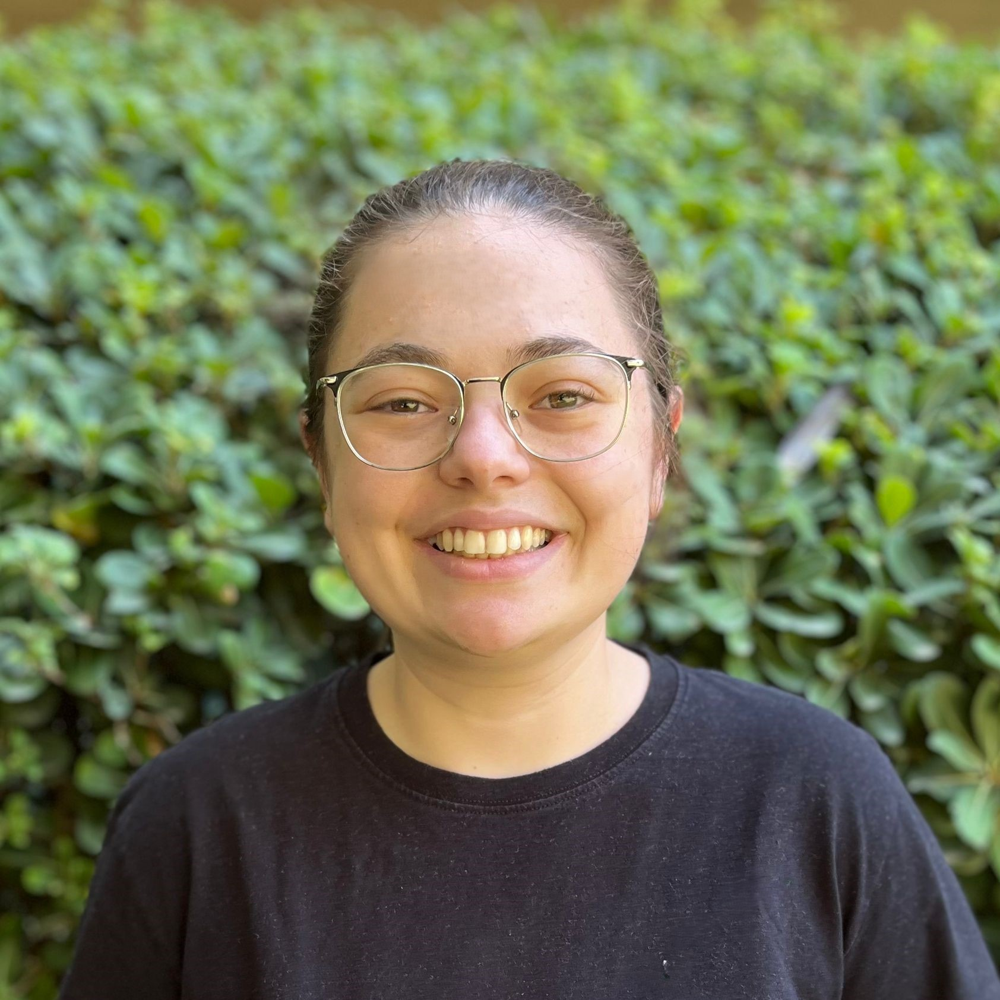
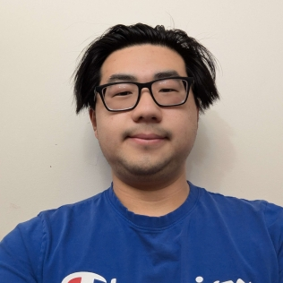
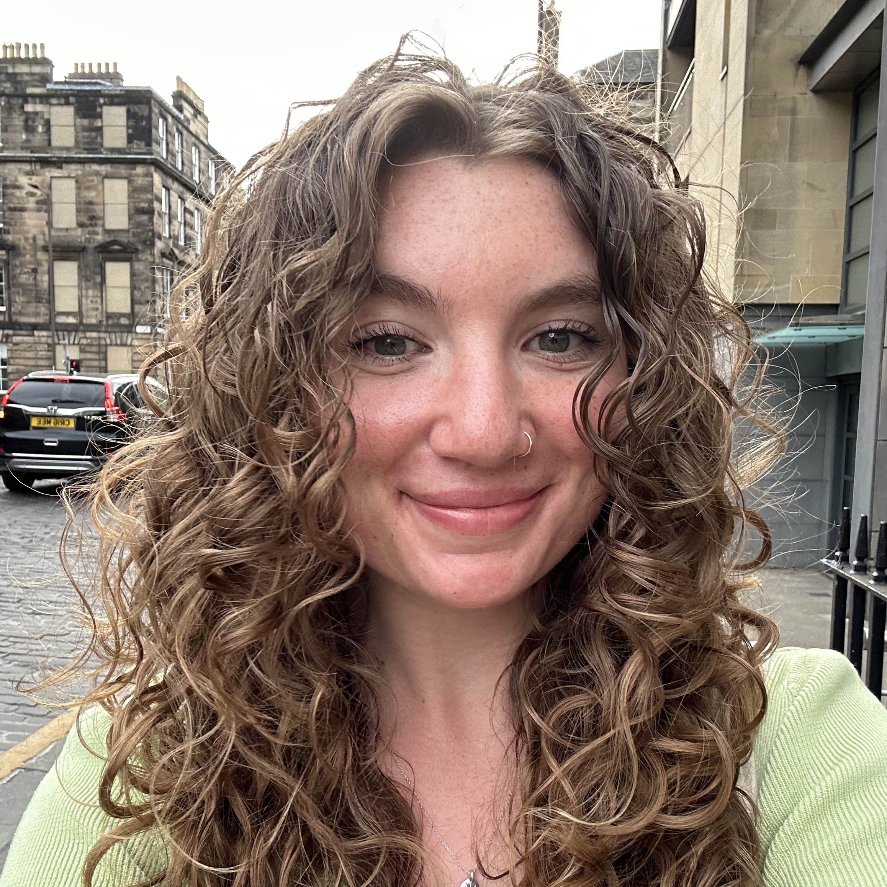
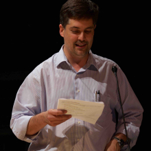
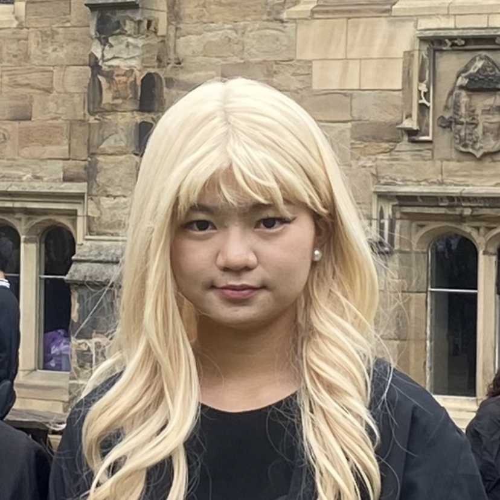

---
title: "Membres"
description: |
lang: fr  

output:
  distill::distill_article:
    self_contained: false
    toc: true
    toc_depth: 3

execute:
  echo: false
  freeze: auto
knitr:
  opts_chunk: 
    collapse: true
    results: false
    warnings: false
---

### Membres actuels du laboratoire

<!--
::: column-margin
L’image de Marty est tirée du [McGill Tribune](https://tinyurl.com/55wf3bae).
:::
-->

::: {#members layout-ncol="6"}
[{fig-alt="Photo de Suresh Krishna"}](#suresh)

[{fig-alt="Photo de Yohai-Eliel Berreby"}](#yohai)

[{fig-alt="Photo de Buxin Liao"}](#buxin)

[{fig-alt="Photo de Maya Aderka"}](#maya)

[{fig-alt="Photo de Alex Zhao"}](#azhao)

[{fig-alt="Photo de Jacky Chen"}](#jacky)

[{fig-alt="Photo de Edward Tong"}](#Edward)

[{fig-alt="Photo de Eliot Mudry Danisch"}](#Eliot)

[{fig-alt="Photo de Samantha Rogers"}](#Sammy)


:::

### Collaborateurs

::: {#collaborators  layout-ncol="5"}
[{fig-alt="Photo de Chris"}](https://www.mcgill.ca/neuro/christopher-pack-phd)

[{fig-alt="Photo de Emmanuel"}](https://www.janelia.org/people/ifedayo-emmanuel-adeyefa-olasupo)

[{fig-alt="Photo de Catherine"}](https://www.mcgill.ca/sis/people/faculty/guastavino)

[{fig-alt="Photo de Fabrice"}](https://www.mcgill.ca/music/fabrice-marandola)

[{fig-alt="Photo de Simone"}](https://brams.org/members/simone-dalla-bella/)

[{fig-alt="Photo de Audrey"}](https://audur2.ift.ulaval.ca/)

[{fig-alt="Photo de Dang Nguyen"}](https://neurosciences.umontreal.ca/recherche/les-chercheurs/dang-khoa-nguyen/)

[{fig-alt="Photo de Marcelo"}](https://www.mcgill.ca/music/marcelo-m-wanderley)

[{fig-alt="Photo de MH"}](https://www.mcgill.ca/spot/marie-helene-boudrias)

[{fig-alt="Photo de Joshua"}](https://www.linkedin.com/in/joshua-rosner-98b15b166/?originalSubdomain=ca)

[{fig-alt="Photo de Jonathan"}](https://www.linkedin.com/in/jonathan-morris-5b841a283/)

[{fig-alt="Photo de Deepansh"}](https://www.linkedin.com/in/deepanshgl)

[{fig-alt="Photo de Alison"}](https://www.linkedin.com/in/-jiaxi-wang/)

[{fig-alt="Photo de Oren"}](https://www.linkedin.com/in/oren-gurevitch/)

[{fig-alt="Photo de Kasia"}](http://www.tinyurl.com/kjurewicz-scholar)

::: 

------------------------------------------------------------------------

<a name="suresh"></a>

#### Suresh Krishna

::: column-margin
{fig-alt="Photo de Suresh Krishna" width="200"}
:::

-   Professeur agrégé, Départment de Physiologie, McGill.

-   MBBS (École de Médecine), AIIMS, New Delhi; Doctorat, NYU, New York.

-   A passé du temps à l'Université Columbia, au CNRS (Lyon), au Centre Allemand de Primates (Goettingen), à l'Institut Max-Planck de Développement Humain (Berlin), avant de venir à McGill (janvier 2020).

-   [Email](mailto:suresh.krishna@mcgill.ca); [Google Scholar]( Google Scholar - https://tinyurl.com/ypeu5ha3)

------------------------------------------------------------------------

<a name="yohai"></a>

#### Yohai-Eliel Berreby

::: column-margin
{fig-alt="Photo de Yohai-Eliel Berreby" width="200"}
:::

-   Étudiant à la Maîtrise, Département de Physiologie, McGill

-   Diplôme d'Ingénieur (B. Sc. et M. Sc. combinés en ingénierie), Télécom Paris, Palaiseau, France

-   MPSI/MP CPGE (Math/Physique [*Classes Préparatoires aux Grandes Écoles*](https://en.wikipedia.org/wiki/Classe_pr%C3%A9paratoire_aux_grandes_%C3%A9coles)), Lycée Hoche, Versailles, France

-   [Email](mailto:yohai-eliel.berreby@mail.mcgill.ca); [GitHub]( https://github.com/yberreby/); [LinkedIn]( https://linkedin.com/in/yberreby)

------------------------------------------------------------------------

<a name="buxin"></a>

#### Buxin Liao

::: column-margin
{fig-alt="Photo de Buxin Liao" width="200"}
:::

-   Étudiant à la Maîtrise, Programme Intégré en Neurosciences (PIN), McGill.

-   Étudiant à la Maîtrise en Ingénierie, Génie Biomédical, Université des Sciences et Technologies Électroniques de Chine, Chengdu, Chine.

-   B. Ing. en Génie Biomédical, Université du Sud-Est, Nanjing, Chine.

-   [Email](mailto:buxin.liao@mail.mcgill.ca); [GitHub]( https://github.com/D-Fonauton)

------------------------------------------------------------------------

<a name="maya"></a>

#### Maya Aderka

::: column-margin
{fig-alt="Photo de Maya Aderka" width="200"}
:::

-   Étudiante en Maîtrise, Département de Physiologie, McGill.

-   Baccalauréat en Psychologie et Informatique avec une spécialisation en Neurosciences, Université de Tel Aviv, Tel Aviv, Israël

-   Pendant mon baccalauréat, j’ai travaillé comme assistante de recherche dans le laboratoire de Prof. Nitzan Censor, qui étudie la mémoire et l’apprentissage. J’ai conduit des études sur les sciences comportementales, ainsi que sur l’EEG, l’IRMf et la TMS.

-   Dans ma dernière année de baccalauréat, j’ai rejoint le laboratoire de sommeil du Prof. Yuval Nir pour collaborer sur la création de SleepEEGpy, une plateforme pour pré-traiter et analyser les données de l'EEG du sommeil.

-   [Email](mailto:maya.aderka@mail.mcgill.ca); [GitHub]( https://github.com/maya-a); [LinkedIn]( https://www.linkedin.com/in/maya-aderka-703b08229/)

------------------------------------------------------------------------

<a name="azhao"></a>

#### Alex Zhao

::: column-margin
{fig-alt="Photo de Alex Zhao" width="200"}
:::

-   Étudiant en Baccalauréat de neurosciences.

-   Mes études et ma recherche se concentrent sur les neurosciences computationnelles, une branche d'études qui met l'emphase sur la découverte de procès neuronaux avec l'aide de système informatiques.

-   Dans mon temps libre, je m'occupe avec la lecture en plus du voyage.

-   [Email](mailto:alex.zhao@mail.mcgill.ca)

------------------------------------------------------------------------

<a name="jacky"></a>

#### Jacky Chen

::: column-margin
{fig-alt="Photo de Jacky Chen" width="200"}
:::

-   Étudiant en Baccalauréat de psychologie avec une double mineure en sciences comportementales et en sciences des arts, à l'Université McGill.

-   Je suis passionné de piano et je m'intéresse aux interactions entre les processus cognitifs, l'expression musicale et les variations de l'attention. Mes recherches explorent les liens entre la psychologie, la musique et les sciences cognitives.

-   Originaire de Shanghai, en Chine, j'y ai vécu jusqu'à l'âge de 18 ans avant de déménager à Montréal pour mes études à l'Université McGill. J'apprécie particulièrement les étés montréalais !

-   [Email](mailto:yijun.chen@mail.mcgill.ca)

------------------------------------------------------------------------

<a name="Edward"></a>

#### Edward Tong

::: column-margin
{fig-alt="Photo de Edward Tong" width="200"}
:::

-   Mes cours en bioingénierie se concentrent souvent sur les element de conception comme en ingénierie tissulaire ou dispositifs microfluidiques. Cependant, mon intérêt a été éveillé lors d'un cours en analyse de signaux (BIEN462) lorsque j'apprenais sur les capacités diagnostiques des ECG. J'ai hâte d'analyser d'autres signaux, comme les EGG. Pendant mon temps libre, j'aime écouter de la musique et jouer à des jeux vidéo.

-   [Email](mailto:edward.tong@mail.mcgill.ca)

------------------------------------------------------------------------

<a name="Eliot"></a>

#### Eliot Mudry Danisch

::: column-margin
{fig-alt="Photo de Eliot Mudry Danisch" width="200"}
:::

-   Étudiant en baccaleauréat de philosophie et politiques avec un mineur en science pour les arts.

-   Je m’intéresse à la philosophie de l'esprit et à l'intersection entre la philosophie et les sciences cognitives. Plus précisément, je m’intéresse aux bases neuronales de la conscience, de la cognition, et de la perception chez les humains et dans l'IA.

-   [Email](mailto:eliot.mudrydanisch@mail.mcgill.ca)

------------------------------------------------------------------------

<a name="Sammy"></a>

#### Samantha Rogers

::: column-margin
{fig-alt="Photo de Samantha Rogers" width="200"}
:::

-   B. Sc. Étudiant en neurosciences, Université McGill

-   Je suis originaire de Californie et j'ai récemment passé un semestre à l'Université d'Édimbourg. Je m'intéresse à l'étude des liens entre la neurophysiologie et le comportement, en particulier la cognition, la mémoire et la prise de décision. J'espère pouvoir approfondir mes connaissances sur les bases neuronales du comportement humain.

-   [Email](mailto:samantha.rogers2@mail.mcgill.ca)

------------------------------------------------------------------------


### D’où Venons-Nous?

<span style="color:#FF3030;">Current</span> /  <span style="color:orange;">Past</span>

```{r,message=FALSE,warning=FALSE}

library(tmap)
library(sf)

data("World")


latlist <- c(8.561259, 30.605053, 32.08233, 43.6532, 53.13333, 43.70313, 48.831704, 30.0444, 41.084148, 37.0, 45.45778, 45.56583, 50.848383801134766, 45.5019, 33.88534, 32.3274, 14.6584, 32.4279, 37.8706, 50.6, 45.25, 48.84674234948124, 31.2304, 41.9001, 31.311206, 60.29335, 45.3, 19.00437473941976, 19.1911, 30.605053, 32.119023, 30.605053, 31.9796, 46.8852, 45.5019, 33.5138, 40.022709, 45.5103643, 45.5103643, 39.9042, 45.51, 31.8775, 31.8206, 28.7041, 24.4539, 43.0722, 36.0671, 29.166128, 43.6532, 37.832602, 19.076)


lonlist <- c(76.874224, 104.074123, 34.881787, -79.3832, 23.16433, 7.26608, 1.609642, 31.2357, 29.03546, 3.0, -73.88489, -73.31437, 4.350009489440508, -73.567, 35.5115, 50.865, 100.3947, 53.688, 112.5486, 3.0, 5.75, 2.3724100000000004, 121.4737, -71.0898, 75.584556, 25.03784, -73.33, 72.85023541069054, 72.856, 104.074123, 34.819675, 104.074123, 120.8937, -56.3159, -73.5674, 36.2765, -75.320869, -73.5746522, -73.5746522, -116.4074, -73.58, 120.5511, 117.2272, 77.1025, 54.3773, -89.40123, 120.3826, 120.055445, -79.3832, -122.210795, 72.8777)

namezlist <- c("suresh", "Haoxiang", "oren", "amanda", "kasia", "Anais", "yohai", "Injy", "Yavuz", "Lilia", "Alexandru", "Youzhi", "noa", "Bradley", "Sarah", "Pegah", "Divi", "Romina", "Sizhuo", "Lilie", "jerome", "Louis", "jacky", "alexparent", "Yagya", "lian", "azhao", "dinesh", "dhruvanshu", "buxin", "maya", "xinning", "evan", "isidore", "sabrina", "taimaa", "annarose", "Yiqing", "Yiqing", "Kevin", "Edward", "Claire", "Lihong", "Deepansh", "Rashed", "Jonathan", "Linjing", "Alison", "Eliot", "Sammy", "Tanya")

nowies <- is.element(namezlist, c("suresh", "yohai", "jacky", "azhao", "buxin", "maya", "Edward", "Eliot", "Sammy"))
oldies <- is.element(namezlist, c("Haoxiang", "oren", "amanda", "kasia", "Anais", "Injy", "Yavuz", "Lilia", "Alexandru", "Youzhi", "noa", "Bradley", "Sarah", "Pegah", "Divi", "Romina", "Sizhuo", "Lilie", "jerome", "Louis", "alexparent", "Yagya", "lian", "dinesh", "dhruvanshu", "xinning", "evan", "isidore", "sabrina", "taimaa", "annarose", "Yiqing", "Yiqing", "Kevin", "Claire", "Lihong", "Deepansh", "Rashed", "Jonathan", "Linjing", "Alison", "Tanya"))

lat<-latlist[nowies]
lon<-lonlist[nowies]

latold<-latlist[oldies]
lonold<-lonlist[oldies]


geocode <- data.frame(lon,lat)
geocode2 <- st_as_sf(geocode, coords = c("lon", "lat"), crs = 4326)

ogeocode <- data.frame(lonold,latold)
ogeocode2 <- st_as_sf(ogeocode, coords = c("lonold", "latold"), crs = 4326)

# tm_shape(World) +
#     tm_fill("lightblue",alpha=1,minimize=TRUE) +
#   tm_layout(bg.color = "black") +
# tm_shape(geocode2) +      # dots shape
#   tm_dots(col = "red", size = .2)

usesize<-1.0 #0.5

tm_shape(World)+
  tm_fill(col='darkslategray2')+
  tm_borders(col="black")+
  tm_layout(
    scale = 0.5,
    bg.color = "dodgerblue4",
    inner.margins = c(0.0005, 0.0005, 0.0005, 0.0005)  # bottom, left, top, right
  )+
  tm_shape(ogeocode2)+
  tm_dots(size = usesize, col = "orange", fill="orange")+
  tm_shape(geocode2)+
  tm_dots(size = usesize, col = "firebrick1", fill="firebrick1")+
     tm_credits("Réalisée avec tmap",
             position = c("RIGHT", "BOTTOM"))
```

### Anciens Membres

* Chercheur postdoctoral - Katarzyna Jurewicz
* Maîtrise 
    + Amanda Pruss (2025), IPN
    + Xinning Le (2025), IPN
	+ Haoxiang Liu (2024), IPN
	+ Buxin Liao (2024), IPN
    + Oren Gurevitch (2025), Physiology
    + Noa Kemp (2025), Physiology
*   PHGY 396 - Sean Solomon, Sarah Beydoun, Pegah Aghili, Jacky Chen
*   PHGY 461 - Isidore Victorri
*   COMP 401 - Nevine Nzabonimpa, Evan Jiang
*   COMP 396 - Evan Jiang
* 	COGS 401/444 - Injy Fouda, Romina Niksirat, Anna Rose Hunt-Isaak
*	PSYC 385/395 - Anais Rubsamen, Alex Parent
*   PSYC 494 - Youzhi Huang, Jacky Chen
*   NSCI 410 - Alexandru Tecu, Lilia Fernane, Alex Zhao 
*   Bourse de Recherche Mackey-Glass -- Tim Yang
*   Fellow de recherche d’été du CDSI – Yiqing Zhu
*   Chercheur·e bénévole - Claire Yang
*   Stage d'été McGill-EAU - Rashed Alhosani
*   Stagiaires MITACS Globalink - Linjing Wang, Jonathan Morris, Alison Jiaxi Wang
*   NSERC SURA - Sabrina Du
*   Stagiaires d’été – Evan Jiang, Yagya Joshi, Kevin (Yuze) Liu
*   Étudiants de 1er Cycle Observateurs - Caden Welch, Max Tweedale, Elisa Niunin, Yavuz Shahzad, Divi Maheshwari, Lilie Jeanneaux, Yagya Joshi, Bradley Austin-Keiller, Lian Mouwes
*   Stagiares (Google Summer of Code) - Dinesh Sathiaraj, Ioannis Valasakis, Prakanshul Saxena, Abhinav Venkatadri, Somnath Sharma, Jyothi Swaroop Reddy Bommareddy, Soham Mulye, Louis Martinez, Armaan Alam, Dinakar Chennupati, Dhruvanshu Joshi, Lihong Chen, Deepansh Goel, Mohd Faisal Ansari

--------------------------------------------------

### Nous

::: {#photos layout-ncol="2"}

{fig-alt="lab1"}

{fig-alt="lab2"}

{fig-alt="lab2"}

{fig-alt="lab2"}

{fig-alt="labgath"}

{fig-alt="labgath"}

:::
