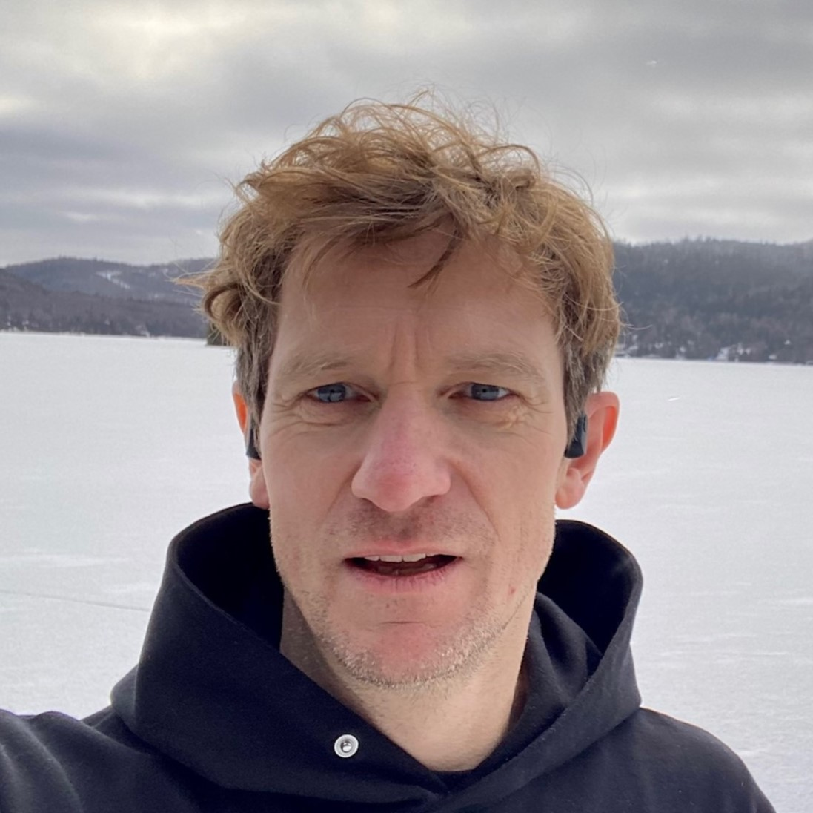
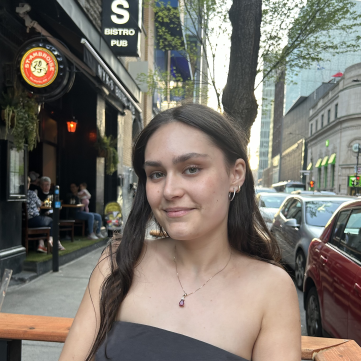
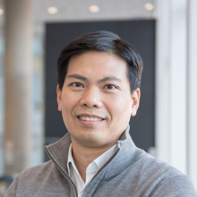
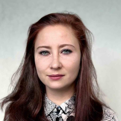
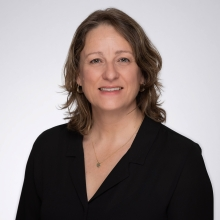
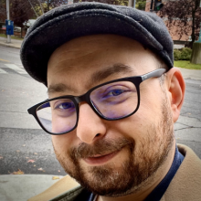
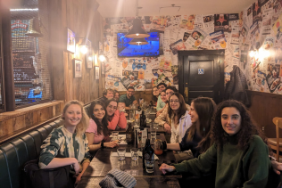
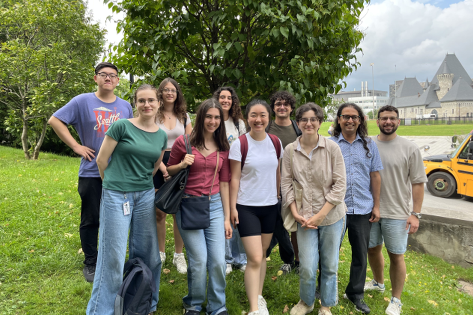

### Membres actuels du laboratoire
<!-- ff -->
::: column-margin
L’image de Marty est tirée du [McGill Tribune](https://tinyurl.com/55wf3bae).
:::

::: {#members layout-ncol="6"}
[{fig-alt="Photo de Suresh"}](#suresh)

[{fig-alt="Photo de Kasia"}](#kasia)

[{fig-alt="Photo de Jerome"}](#jerome)

[{fig-alt="Photo de Yohai"}](#yohai)

[{fig-alt="Photo de Amanda"}](#amanda)

[{fig-alt="Photo de Oren"}](#oren)

[{fig-alt="Photo de Buxin"}](#buxin)

[{fig-alt="Photo de Noa"}](#noa)

[{fig-alt="Photo de Xinning"}](#xinning)

[{fig-alt="Photo de Jacky"}](#jacky)

[{fig-alt="Photo de Yagya"}](#yagya)

[{fig-alt="Photo de Lian"}](#lian)

[{fig-alt="Photo of Alex"}](#azhao)

:::

[comm1]: # (### Étudiants de 1er Cycle Observateurs Actuels) 
[comm2]: # (::: {#observers layout-ncol="5"})
[comm3]: # ([{fig-alt="Photo de Yavuz"}](#yavuz))
[comm4]: # (:::)
[comm5]: # ### Stagiares - Google Summer of Code
[comm6]: # * Jyothi Swaroop Reddy Bommareddy


### Collaborateurs

::: {#collaborators  layout-ncol="5"}
[{fig-alt="Photo de Chris"}](https://www.mcgill.ca/neuro/christopher-pack-phd)

[{fig-alt="Photo de Emmanuel"}](https://www.janelia.org/people/ifedayo-emmanuel-adeyefa-olasupo)

[{fig-alt="Photo de Catherine"}](https://www.mcgill.ca/sis/people/faculty/guastavino)

[{fig-alt="Photo de Fabrice"}](https://www.mcgill.ca/music/fabrice-marandola)

[{fig-alt="Photo de Simone"}](https://brams.org/members/simone-dalla-bella/)

[{fig-alt="Photo de Hongmei"}](https://www.neuro.uestc.edu.cn/vccl/yhm.html)

[{fig-alt="Photo de Dang Nguyen"}](https://neurosciences.umontreal.ca/recherche/les-chercheurs/dang-khoa-nguyen/)

[{fig-alt="Photo de Pauline"}](https://www.pauline-patie.com/)

[{fig-alt="Photo de MH"}](https://www.mcgill.ca/spot/marie-helene-boudrias)

[{fig-alt="Photo de Joshua"}](https://www.linkedin.com/in/joshua-rosner-98b15b166/?originalSubdomain=ca)

::: 

------------------------------------------------------------------------

<a name="suresh"></a>

#### Suresh Krishna

::: column-margin
{fig-alt="Photo de Suresh" width="200"}
:::

-   Professeur agrégé, Départment de Physiologie, McGill.

-   MBBS (École de Médecine), AIIMS, New Delhi; Doctorat, NYU, New York.

-   A passé du temps à l'Université Columbia, au CNRS (Lyon), au Centre Allemand de Primates (Goettingen), à l'Institut Max-Planck de Développement Humain (Berlin), avant de venir à McGill (janvier 2020).

-   [Courriel](mailto:suresh.krishna@mcgill.ca); [Google Scholar](https://tinyurl.com/ypeu5ha3)

------------------------------------------------------------------------

<a name="kasia"></a>

#### Katarzyna (Kasia) Jurewicz

::: column-margin
{fig-alt="Photo de Kasia" width="200"}
:::

-   Boursière Post-Doctorale, Département de Physiologie, McGill.
-   Maîtrise en Psychologie, Université de Varsovie ; Doctorat en Neurobiologie, Institut Nencki de Biologie Expérimentale, Académie Polonaise des Sciences, Varsovie.
-   Auparavant, j'étais post-doc dans le laboratoire du Dr Becket Ebitz (Laboratoire de recherche sur le bruit) à l'Université de Montréal. Précédemment, j'ai mené des recherches dans le groupe cortico-thalamique du Dr Ewa Kublik à l'Institut Nencki de biologie expérimentale. Mon travail de doctorat a été supervisé par le professeur Andrzej Wróbel au Laboratoire du Système Visuel de Nencki.
-   [Courriel](mailto:katarzyna.jurewicz@mcgill.ca);[Google Scholar](http://www.tinyurl.com/kjurewicz-scholar)

------------------------------------------------------------------------

<a name="jerome"></a>

#### Jerome Carriot

::: column-margin
{fig-alt="Photo of Jerome" width="200"}
:::

-   Chercheur Associé, Département de Physiologie, McGill.
-   Doctorat, Université Joseph Fourier, Grenoble, France.
-   Dans les 20 dernières années, j'ai travaillé sur le système vestibulaire. J'ai occupé des postes de postdoctorant et de chercheur associé dans plusieurs universités, notamment à l'Université Brandeis à Boston, à l'Université de Western Ontario à London, et à l'Université McGill. Je m'intéresse plus spéciquement à l'encodage de son propre déplacement par les neurones dans toute la voie vestibulaire.
-   [Email](mailto:Jerome.carriot@mcgill.ca); [Google Scholar](https://scholar.google.ca/citations?hl=en&user=rEzMXEUAAAAJ); [ResearchGate](https://www.researchgate.net/profile/Jerome-Carriot)

--------------------------------------------------------------------------

<a name="yohai"></a>

#### Yohaï-Eliel Berreby

::: column-margin
{fig-alt="Photo de Yohai" width="200"}
:::

-   Étudiant à la Maîtrise, Département de Physiologie, McGill
-   *Diplôme d'Ingénieur* (B. Sc. et M. Sc. combinés en ingénierie), Télécom Paris, Palaiseau, France
-   MPSI/MP CPGE (Math/Physique [*Classes Préparatoires aux Grandes Écoles*](https://en.wikipedia.org/wiki/Classe_pr%C3%A9paratoire_aux_grandes_%C3%A9coles)), Lycée Hoche, Versailles, France
-   [Courriel](mailto:yohai-eliel.berreby@mail.mcgill.ca), [GitHub](https://github.com/yberreby/), [LinkedIn](https://linkedin.com/in/yberreby)

------------------------------------------------------------------------

<a name="amanda"></a>

#### Amanda Pruss

* Étudiante à la Maîtrise, Programme Intégré en Neurosciences (PIN), McGill.
* B.A. en Psychologie, McGill.
* J'aimerais aussi appliquer mes connaissances en neurosciences dans un cadre clinique, afin d'aider les personnes souffrant de troubles de la vision, de l'attention ou d'épilepsie.
* [Courriel](mailto: amanda.pruss@mail.mcgill.ca), [GitHub](https://github.com/amandapruss), [LinkedIn](https://www.linkedin.com/in/amanda-pruss-a78813261/)

------------------------------------------------------------------------

<a name="oren"></a>

#### Oren Gurevitch

::: column-margin
{fig-alt="Photo de Oren" width="200"}
:::

-   Étudiant à la Maîtrise, Département de Physiologie, McGill.
-   B. Sc. en Neuroscience, Université Bar-Ilan, Ramat Gan, Israel.
-   Précédemment, j'étais assistant de recherche sur le traitement sensoriel chez les rats, à l'Université Bar-Ilan, sous la direction du professeur Adam Zaidel. Avant cela, en tant qu'assistant de laboratoire à l'Institut Weizmann des Sciences, j'ai travaillé sur la recherche sur la sclérose en plaques avec le professeur Idit Shachar.
-   [Courriel](mailto:oren.gurevitch@mail.mcgill.ca), [GitHub](https://github.com/OrenGurevitch), [LinkedIn](https://www.linkedin.com/in/oren-gurevitch/)

------------------------------------------------------------------------

<a name="buxin"></a>

#### Buxin Liao

::: column-margin
{fig-alt="Photo de Buxin" width="200"}
:::

-   Étudiant à la Maîtrise, Programme Intégré en Neurosciences (PIN), McGill.
-   Étudiant à la Maîtrise en Ingénierie, Génie Biomédical, Université des Sciences et Technologies Électroniques de Chine, Chengdu, Chine.
-   B. Ing. en Génie Biomédical, Université du Sud-Est, Nanjing, Chine.
-   [Courriel](mailto:buxin.liao@mail.mcgill.ca), [GitHub](https://github.com/D-Fonauton)

------------------------------------------------------

<a name="noa"></a>

#### Noa Kemp

::: column-margin
{fig-alt="Photo de Noa" width="200"}
:::

-   Étudiante à la Maîtrise, Département de Physiologie, McGill.
-   Baccalauréat complété à McGill en Biologie et Informatique.
-   Entre la comédie musicale, l’informatique et le cerveau - je suis incapable de choisir, alors je compte étudier une de leur intersection: l'espace audiovisuel et la perception d'objets.
-   J'ai vécu toute mon enfance en Belgique, mais la moitié de ma famille est en Israël et j’y ai passé la plupart de mes étés. Aujourd’hui, là où je me sens le plus chez-moi est clairement Montréal.
-   [Courriel](mailto:noa.kemp@mail.mcgill.ca)

------------------------------------------------------------------

<a name="xinning"></a>

#### Xinning Le

::: column-margin
{fig-alt="Photo de Xinning" width="200"}
:::

* Étudiant à la Maîtrise, Programme Intégré en Neurosciences (PIN), McGill.
* Étudiant à la Maîtrise en Ingénierie, Génie Biomédical, Université des Sciences et Technologies Électroniques de Chine, Chengdu, Chine.
* B. Ing. en Sécurité de l'information, Université des postes et télécommunications de Xi'an, Xian, Chine.
* [Courriel](mailto:xinning.le@mail.mcgill.ca)

------------------------------------------------------------------------

<a name="jacky"></a>

#### Jacky Chen

::: column-margin
{fig-alt="Photo de Jacky" width="200"}
:::

* Étudiant en Baccalauréat de psychologie avec une double mineure en sciences comportementales et en sciences des arts, à l'Université McGill.
* Je suis passionné de piano et je m'intéresse aux interactions entre les processus cognitifs, l'expression musicale et les variations de l'attention. Mes recherches explorent les liens entre la psychologie, la musique et les sciences cognitives.
* Originaire de Shanghai, en Chine, j'y ai vécu jusqu'à l'âge de 18 ans avant de déménager à Montréal pour mes études à l'Université McGill. J'apprécie particulièrement les étés montréalais !
* [Email](mailto:yijun.chen@mail.mcgill.ca)

------------------------------------------------------------------------

<a name="alexparent"></a>

#### Alex Parent

::: column-margin
{fig-alt="Photo de Alex" width="200"}
:::


* Étudiante en Baccalauréat de psychologie, à l'Université McGill.
* Jouant de sept instruments et passionné de neurosciences, je suis fasciné par les interactions entre la musique et le cerveau.
* [Email](mailto:alexandra.parent@mail.mcgill.ca), [LinkedIn](https://www.linkedin.com/in/alex-parent-82b456261)

------------------------------------------------------------------------

<a name="lian"></a>

#### Lian Mouwes

::: column-margin
{fig-alt="Photo de Lian" width="200"}
:::

* B.A.SC. étudiante au sein du programme de sciences cognitives à l'université de McGill. Je complète aussi un diplôme en développement international en parallèle de mon diplôme principal.
* Je me suis familiarisé avec les systèmes de suivi de la vision grâce à une  précédente expérience au sein de l'université de Tel Aviv .
* Je suis passionné par les connections et relations qui peuvent être trouvées et analysées entre le cerveau et les ordinateurs. Dans mon temps libre, je prends beaucoup de plaisir à pratiquer le yoga.
* Je suis  Finlandaise/ Israélienne, je suis cependant né à Bruxelles. J'ai grandi entre l'Israel et la Belgique et par la suite déménagé à Montréal afin de poursuivre mes études.
* [Email](mailto:lian.mouwes@icloud.com), [LinkedIn](http://linkedin.com/in/lian-m-46939229b)
--------------------------------------------------------------------

<a name="azhao"></a>

#### Alex Zhao

::: column-margin
{fig-alt="Photo de AlexZhao" width="200"}
:::

* Étudiant en Baccalauréat de neurosciences.
* Mes études et ma recherche se concentrent sur les neurosciences computationnelles, une branche d'études qui met l'emphase sur la découverte de procès neuronaux avec l'aide de système informatiques. 
* Dans mon temps libre, je m'occupe avec la lecture en plus du voyage.
* [Email](mailto:alex.zhao@mail.mcgill.ca)

------------------------------------------------------------------------

### D’où Venons-Nous?

<span style="color:firebrick1;">Current</span> /  <span style="color:orange;">Past</span>

```{r,message=FALSE,warning=FALSE}
#| warning: false
library(tmap)
library(sf)

data("World")

latlist <- c(8.561259, 30.605053,32.082330,43.6532,53.13333,43.70313,48.831704,30.0444,41.084148,37,45.45778,45.56583,50.848383801134766,45.5019,33.885340,32.3274,14.6584,32.4279,37.8706,50.6,45.25,48.84674234948124,31.2304,41.9001,31.311206,60.29335,45.30 )

lonlist <- c(76.874224, 104.074123,34.881787,-79.3832,23.16433,7.26608,1.609642,31.2357,29.035460,3,-73.88489,-73.31437,4.350009489440508,-73.567,35.511500,50.8650,100.3947,53.6880,112.5486,3,5.75,2.3724100000000004,121.4737,-71.0898,75.584556,25.03784,-73.33)

namezlist <- c('Suresh','Haoxiang','Oren','Amanda','Kasia','Anais','Yohai','Injy','Yavuz','Lilia','Alexandru','Youzhi','Noa','Bradley','Sarah','Pegah','Divi','Romina','Sizhuo','Lilie','Jerome','Louis','Jacky','AlexParent','Yagya','Lian','Alex')

nowies<-is.element(namezlist,c('Suresh','Oren','Amanda','Kasia','Yohai','Noa','Jerome','Jacky','AlexParent','Lian','Alex'))
oldies<-is.element(namezlist,c('Injy','Sarah','Pegah','Yavuz','Divi','Alexandru','Lilia','Youzhi','Romina','Anais','Haoxiang','Lilie','Yagya','Louis','Bradley'))

lat<-latlist[nowies]
lon<-lonlist[nowies]

latold<-latlist[oldies]
lonold<-lonlist[oldies]


geocode <- data.frame(lon,lat)
geocode2 <- st_as_sf(geocode, coords = c("lon", "lat"), crs = 4326)

ogeocode <- data.frame(lonold,latold)
ogeocode2 <- st_as_sf(ogeocode, coords = c("lonold", "latold"), crs = 4326)

# tm_shape(World) +
#     tm_fill("lightblue",alpha=1,minimize=TRUE) +
#   tm_layout(bg.color = "black") +
# tm_shape(geocode2) +      # dots shape
#   tm_dots(col = "red", size = .2)

usesize<-1 #0.5

tm_shape(World)+
  tm_fill(col='darkslategray2')+
  tm_borders(col="black")+
  tm_layout(scale=0.5, bg.color="dodgerblue4",inner.margin=0.0005)+
  tm_shape(ogeocode2)+
  tm_dots(size = usesize, col = "orange")+
  tm_shape(geocode2)+
  tm_dots(size = usesize, col = "firebrick1")+
  tm_layout()+
     tm_credits("Réalisée avec tmap",
             position = c("RIGHT", "BOTTOM"))
```

### Anciens Membres

* Maîtrise 
	+ Haoxiang Liu (2024), IPN
	+ Buxin Liao (2024), IPN
*   PHGY 396 - Sean Solomon, Sarah Beydoun, Pegah Aghili
*   COMP 401 - Nevine Nzabonimpa
* 	COGS 444 - Injy Fouda
*	PSYC 395 - Anais Rubsamen 
*   PSYC 494 - Youzhi Huang
*   NSCI 410 - Alexandru Tecu, Lilia Fernane 
*   Bourse de Recherche Mackey-Glass -- Tim Yang
*   Étudiants de 1er Cycle Observateurs - Caden Welch, Max Tweedale, Elisa Niunin, Yavuz Shahzad, Divi Maheshwari, Lilie Jeanneaux, Yagya Joshi
*   Stagiares - Google Summer of Code - Dinesh Sathiaraj, Ioannis Valasakis, Prakanshul Saxena, Abhinav Venkatadri, Somnath Sharma, Jyothi Swaroop Reddy Bommareddy, Soham Mulye
*   Stagiares - Louis Martinez, Bradley Austin-Keiller
--------------------------------------------------

### Nous

::: {#photos layout-ncol="2"}

{fig-alt="lab1"}

{fig-alt="lab2"}

{fig-alt="lab2"}

{fig-alt="lab2"}

{fig-alt="labgath"}

{fig-alt="labgath"}

:::
