### Membres actuels du laboratoire
<!-- ff -->
::: column-margin
L’image de Marty est tirée du [McGill Tribune](https://tinyurl.com/55wf3bae).
:::

::: {#members layout-ncol="5"}
[{fig-alt="Photo of Suresh"}](#suresh)

[{fig-alt="Photo of Kasia"}](#kasia)

[{fig-alt="Photo of Yohai"}](#yohai)

[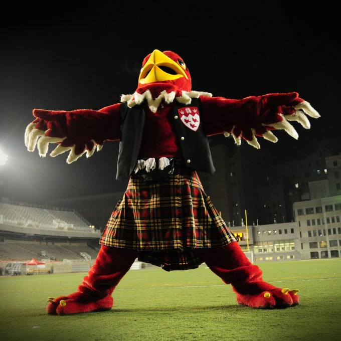{fig-alt="Photo of Amanda"}](#amanda)

[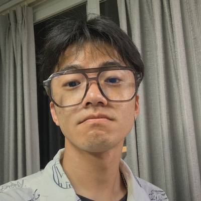{fig-alt="Photo of Haoxiang"}](#haoxiang)

[{fig-alt="Photo of Oren"}](#oren)

[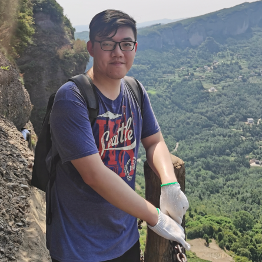{fig-alt="Photo of Buxin"}](#buxin)

[{fig-alt="Photo of Chen"}](#chen)

[{fig-alt="Photo of Noa"}](#noa)

[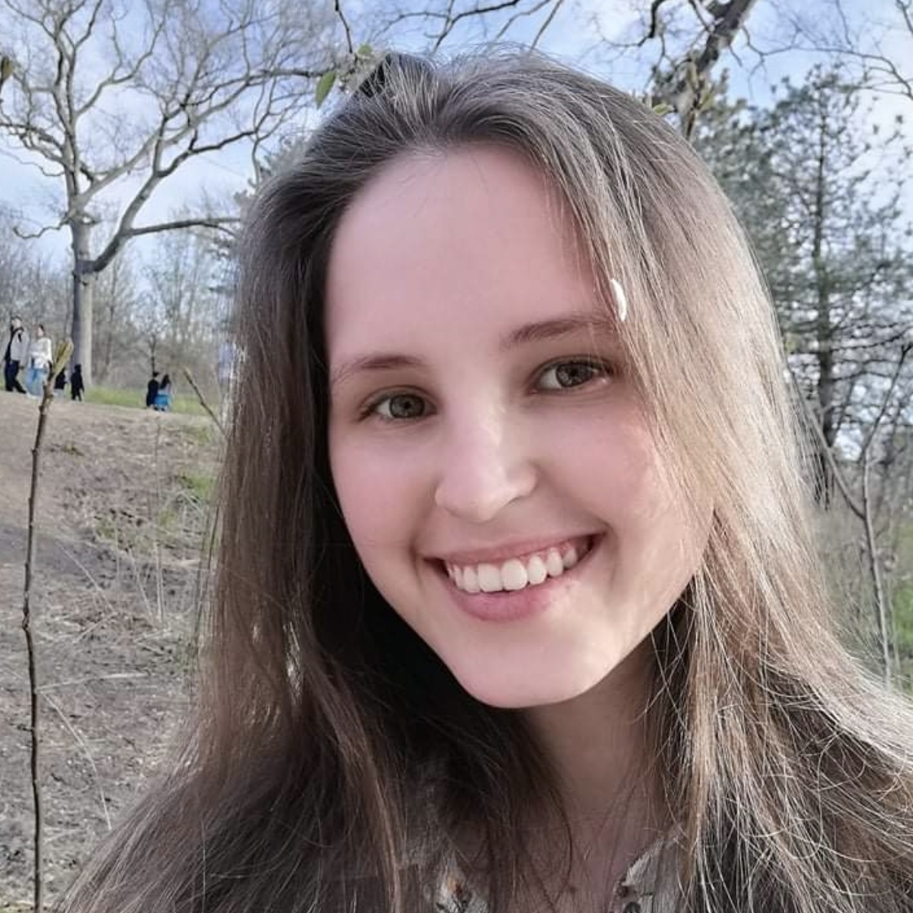{fig-alt="Photo of Anais"}](#anais)

[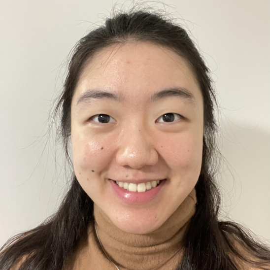{fig-alt="Photo of Youzhi"}](#youzhi)

[{fig-alt="Photo of Alexandru"}](#alexandru)

[{fig-alt="Photo of Bradley"}](#bradley)

[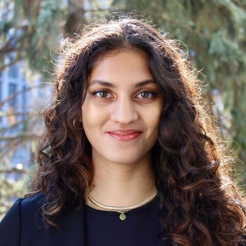{fig-alt="Photo of Divi"}](#divi)

[{fig-alt="Photo of Marty"}](#lilia)

:::

[comm1]: # (### Étudiants de 1er Cycle Observateurs Actuels) 
[comm2]: # (::: {#observers layout-ncol="5"})
[comm3]: # ([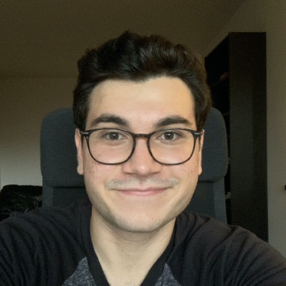{fig-alt="Photo of Yavuz"}](#yavuz))
[comm4]: # (:::)
### Stagiares - Google Summer of Code

* Jyothi Swaroop Reddy Bommareddy
* Soham Mulye

### Collaborators

::: {#members layout-ncol="5"}
[{fig-alt="Photo de Chris"}](https://www.mcgill.ca/neuro/christopher-pack-phd)

[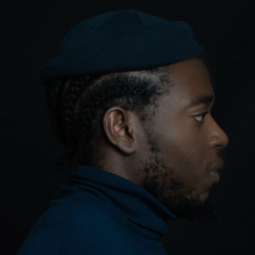{fig-alt="Photo de Emmanuel"}](https://www.janelia.org/people/ifedayo-emmanuel-adeyefa-olasupo)

[{fig-alt="Photo de Catherine"}](https://www.mcgill.ca/sis/people/faculty/guastavino)

[{fig-alt="Photo de Fabrice"}](https://www.mcgill.ca/music/fabrice-marandola)

[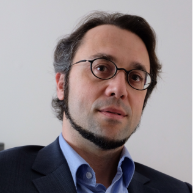{fig-alt="Photo de Simone"}](https://brams.org/members/simone-dalla-bella/)

::: 

------------------------------------------------------------------------

<a name="suresh"></a>

#### Suresh Krishna

::: column-margin
{fig-alt="Photo of Suresh" width="200"}
:::

-   Professeur agrégé, Départment de Physiologie, McGill.

-   MBBS (École de Médecine), AIIMS, New Delhi; Doctorat, NYU, New York.

-   A passé du temps à l'Université Columbia, au CNRS (Lyon), au Centre Allemand de Primates (Goettingen), à l'Institut Max-Planck de Développement Humain (Berlin), avant de venir à McGill (janvier 2020).

-   [Courriel](mailto:suresh.krishna@mcgill.ca); [Google Scholar](https://tinyurl.com/ypeu5ha3)

------------------------------------------------------------------------

<a name="kasia"></a>

#### Katarzyna (Kasia) Jurewicz

::: column-margin
{fig-alt="Photo of Kasia" width="200"}
:::

-   Boursière Post-Doctorale, Département de Physiologie, McGill.
-   Maîtrise en Psychologie, Université de Varsovie ; Doctorat en Neurobiologie, Institut Nencki de Biologie Expérimentale, Académie Polonaise des Sciences, Varsovie.
-   Auparavant, j'étais post-doc dans le laboratoire du Dr Becket Ebitz (Laboratoire de recherche sur le bruit) à l'Université de Montréal. Précédemment, j'ai mené des recherches dans le groupe cortico-thalamique du Dr Ewa Kublik à l'Institut Nencki de biologie expérimentale. Mon travail de doctorat a été supervisé par le professeur Andrzej Wróbel au Laboratoire du Système Visuel de Nencki.
-   [Courriel](mailto:katarzyna.jurewicz@mcgill.ca);[Google Scholar](http://www.tinyurl.com/kjurewicz-scholar)

------------------------------------------------------------------------

<a name="yohai"></a>

#### Yohaï-Eliel Berreby

::: column-margin
{fig-alt="Photo of Yohai" width="200"}
:::

-   Étudiant à la Maîtrise, Département de Physiologie, McGill
-   *Diplôme d'Ingénieur* (B. Sc. et M. Sc. combinés en ingénierie), Télécom Paris, Palaiseau, France
-   MPSI/MP CPGE (Math/Physique [*Classes Préparatoires aux Grandes Écoles*](https://en.wikipedia.org/wiki/Classe_pr%C3%A9paratoire_aux_grandes_%C3%A9coles)), Lycée Hoche, Versailles, France
-   [Courriel](mailto:yohai-eliel.berreby@mail.mcgill.ca), [GitHub](https://github.com/yberreby/), [LinkedIn](https://linkedin.com/in/yberreby)

------------------------------------------------------------------------

<a name="amanda"></a>

#### Amanda Pruss

* Étudiante à la Maîtrise, Programme Intégré en Neurosciences (PIN), McGill.
* B.A. en Psychologie, McGill.
* J'aimerais aussi appliquer mes connaissances en neurosciences dans un cadre clinique, afin d'aider les personnes souffrant de troubles de la vision, de l'attention ou d'épilepsie.
* [Courriel](mailto: amanda.pruss@mail.mcgill.ca), [GitHub](https://github.com/amandapruss), [LinkedIn](https://www.linkedin.com/in/amanda-pruss-a78813261/)

------------------------------------------------------------------------

<a name="haoxiang"></a>

#### Haoxiang Liu

::: column-margin
{fig-alt="Photo of Haoxiang" width="200"}
:::

-   Étudiant à la Maîtrise, Département de Physiologie, McGill.
-   Étudiant à la Maîtrise en Ingénierie, Génie Biomédical, Université des Sciences et Technologies Électroniques de Chine, Chengdu, Chine.
-   B. Ing. en Génie des Réseaux, Université des Sciences et Technologies Électroniques de Chine, Chengdu, Chine.
-   [Courriel](mailto:haoxiang.liu@mail.mcgill.ca), [GitHub](https://github.com/hxliu4mcgill)

------------------------------------------------------------------------

<a name="oren"></a>

#### Oren Gurevitch

::: column-margin
{fig-alt="Photo of Oren" width="200"}
:::

-   Étudiant à la Maîtrise, Département de Physiologie, McGill.
-   B. Sc. en Neuroscience, Université Bar-Ilan, Ramat Gan, Israel.
-   Précédemment, j'étais assistant de recherche sur le traitement sensoriel chez les rats, à l'Université Bar-Ilan, sous la direction du professeur Adam Zaidel. Avant cela, en tant qu'assistant de laboratoire à l'Institut Weizmann des Sciences, j'ai travaillé sur la recherche sur la sclérose en plaques avec le professeur Idit Shachar.
-   [Courriel](mailto:oren.gurevitch@mail.mcgill.ca), [GitHub](https://github.com/OrenGurevitch), [LinkedIn](https://www.linkedin.com/in/oren-gurevitch/)

------------------------------------------------------------------------

<a name="buxin"></a>

#### Buxin Liao

::: column-margin
{fig-alt="Photo of Buxin" width="200"}
:::

-   Étudiant à la Maîtrise, Département de Physiologie, McGill.
-   Étudiant à la Maîtrise en Ingénierie, Génie Biomédical, Université des Sciences et Technologies Électroniques de Chine, Chengdu, Chine.
-   B. Ing. en Génie Biomédical, Université du Sud-Est, Nanjing, Chine.
-   [Courriel](mailto:buxin.liao@mail.mcgill.ca), [GitHub](https://github.com/D-Fonauton)

------------------------------------------------------

<a name="chen"></a>

#### Chen Liu

::: column-margin
{fig-alt="Photo of Chen" width="200"}
:::

-   Étudiant à la Maîtrise, Département de Physiologie, McGill.
-   Étudiant à la Maîtrise en Ingénierie, Génie Biomédical, Université des Sciences et Technologies Électroniques de Chine, Chengdu, Chine.
-   B. Ing. en Génie Environnementale, Université du Sud-Est, Nanjing, Chine.
-   Je m'intéresse au développement de la technologie EEG et à la recherche sur les méthodes BCI.
-   [Courriel](mailto:chen.liu6@mail.mcgill.ca)

-----------------------------------------------------------

<a name="noa"></a>

#### Noa Kemp

::: column-margin
{fig-alt="Photo of Noa" width="200"}
:::

-   Étudiante à la Maîtrise, Département de Physiologie, McGill.
-   Baccalauréat complété à McGill en Biologie et Informatique.
-   Entre la comédie musicale, l’informatique et le cerveau - je suis incapable de choisir, alors je compte étudier une de leur intersection: l'espace audiovisuel et la perception d'objets.
-   J'ai vécu toute mon enfance en Belgique, mais la moitié de ma famille est en Israël et j’y ai passé la plupart de mes étés. Aujourd’hui, là où je me sens le plus chez-moi est clairement Montréal.
-   [Courriel](mailto:noa.kemp@mail.mcgill.ca)


------------------------------------------------------------------

<a name="alexandru"></a>

#### Alexandru Tecu

-   Étudiant au Baccalauréat en Neurosciences, Université McGill.
-   Présentement en train de poursuivre mes études dans le domaine de Neurophysiologie/Neurosciences Computationnelles.
-   [Courriel](mailto:alexandru.tecu.0@gmail.com)


-----------------------------------------------------------

<a name="youzhi"></a>

#### Youzhi Huang

::: column-margin
{fig-alt="Photo of Youzhi" width="200"}
:::

- Étudiante au Baccalauréat en Psychologie, Université McGill.
- Je suis intéressée par l’aspect cognitif car il permet d’expliquer certains comportements, l’esprit humain, informer des interventions et notamment avancer nos connaissances en processus cognitifs.
- [Courriel](mailto:youzhi.huang@mail.mcgill.ca)

---------------------------------------------------------

<a name="bradley"></a>

#### Bradley Austin-Keiller

::: column-margin
{fig-alt="Photo of Bradley" width="200"}
:::


- Étudiant en dip. 2e c en Musicothérapie , Faculté des Beaux-Arts, Concordia.
- Baccalauréat complété en Musique et Psychologie, Université McGill.
- En combinant une dizaine d'années de formation musicale avec de l'expérience clinique, j’aspire à combler cet écart en examinant l’activité physiologique et neuronale en rapport avec la musicothérapie. Je me concentre particulièrement sur l’intersection entre la promotion de santé et de la musique. 
- [Courriel](mailto:Bradleyaustinkeiller@videotron.ca), [LinkedIn](https://www.linkedin.com/in/bradley-austin-keiller-297787212/)

-------------------------

<a name="anais"></a>

#### Anais Rubsamen

::: column-margin
{fig-alt="Photo of Anais" width="200"}
:::

* Étudiante au Baccalauréat en Psychologie, Université McGill.
* À court terme, je souhaite maîtriser les logiciels, les technologies et les techniques utilisés dans la recherche et les traitements en psychologie, avec un accent particulier sur Python et R. À long terme, je souhaite développer des stratégies pour améliorer les soins aux personnes vivant avec des psychopathologies et des douleurs chroniques, avec un accent particulier sur le TPB.
* [Courriel](mailto:%20anais.rubsamen@mail.mcgill.ca), [LinkedIn](https://www.linkedin.com/in/anaïs-issaeva-rubsamen-9ba222217/) 

------------------------------------------------------------------------

<a name="divi"></a>

#### Divi Maheshwari

::: column-margin
{fig-alt="Photo of Divi" width="200"}
:::

* B.A. en Psychologie et Histoire, McGill.
* Je travaille actuellement à apprendre une interface d'oculométrie ainsi que la programmation MATLAB, avant d'entamer un projet indépendant avec le laboratoire.
* [Email](mailto:divi.maheshwari@mail.mcgill.ca), [LinkedIn](https://www.linkedin.com/in/divimaheshwari/)

---------------------------------------------------------


<a name="lilia"></a>

#### Lilia Fernane

* U3 Étudiante au Baccalauréat en Neuroscience, Université McGill
* [Courriel](mailto:lilia.fernane@mail.mcgill.ca)

------------------------------------------------------------------------


### D’où Venons-Nous?

<span style="color:firebrick1;">Current</span> /  <span style="color:orange;">Past</span>

```{r,message=FALSE,warning=FALSE}
#| warning: false
library(tmap)
library(sf)

data("World")

latlist <- c(8.561259, 30.605053,32.082330,43.6532,53.13333,43.70313,48.831704,30.0444,41.084148,37,45.45778,45.56583,50.848383801134766,45.5019,33.885340,32.3274,14.6584)
lonlist <- c(76.874224, 104.074123,34.881787,-79.3832,23.16433,7.26608,1.609642,31.2357,29.035460,3,-73.88489,-73.31437,4.350009489440508,-73.567,35.511500,50.8650,100.3947)
namezlist <- c('Suresh','Haoxiang','Oren','Amanda','Kasia','Anais','Yohai','Injy','Yavuz','Lilia','Alexandru','Youzhi','Noa','Bradley','Sarah','Pegah','Divi')


nowies<-is.element(namezlist,c('Suresh','Haoxiang','Oren','Amanda','Kasia','Anais','Yohai','Lilia','Alexandru','Youzhi','Noa','Bradley','Divi'))
oldies<-is.element(namezlist,c('Injy','Sarah','Pegah','Yavuz'))

lat<-latlist[nowies]
lon<-lonlist[nowies]

latold<-latlist[oldies]
lonold<-lonlist[oldies]


geocode <- data.frame(lon,lat)
geocode2 <- st_as_sf(geocode, coords = c("lon", "lat"), crs = 4326)

ogeocode <- data.frame(lonold,latold)
ogeocode2 <- st_as_sf(ogeocode, coords = c("lonold", "latold"), crs = 4326)

# tm_shape(World) +
#     tm_fill("lightblue",alpha=1,minimize=TRUE) +
#   tm_layout(bg.color = "black") +
# tm_shape(geocode2) +      # dots shape
#   tm_dots(col = "red", size = .2)

usesize<-0.5

tm_shape(World)+
  tm_fill(col='darkslategray2')+
  tm_borders(col="black")+
  tm_layout(scale=0.5, bg.color="dodgerblue4",inner.margin=0.0005)+
  tm_shape(ogeocode2)+
  tm_dots(size = usesize, col = "orange")+
  tm_shape(geocode2)+
  tm_dots(size = usesize, col = "firebrick1")+
  tm_layout()+
     tm_credits("Réalisée avec tmap",
             position = c("RIGHT", "BOTTOM"))
```

### Anciens Étudiants

-   PHGY 396 - Sean Solomon, Sarah Beydoun, Pegah Aghili
-   COMP 401 - Nevine Nzabonimpa
- 	COGS 444 Injy Fouda
-	PSYC 395 Anais Rubsamen 
-   Bourse de Recherche Mackey-Glass -- Tim Yang
-   Étudiants de 1er Cycle Observateurs - Caden Welch, Max Tweedale, Elisa Niunin, Yavuz Shahzad
-   Stagiares - Google Summer of Code - Dinesh Sathiaraj, Ioannis Valasakis, Prakanshul Saxena, Abhinav Venkatadri, Somnath Sharma.

--------------------------------------------------

### Nous

::: {#photos layout-ncol="2"}

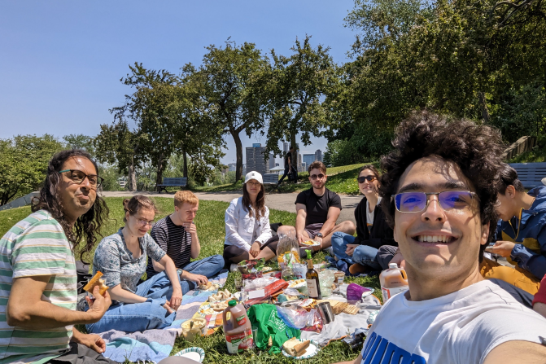{fig-alt="lab1"}

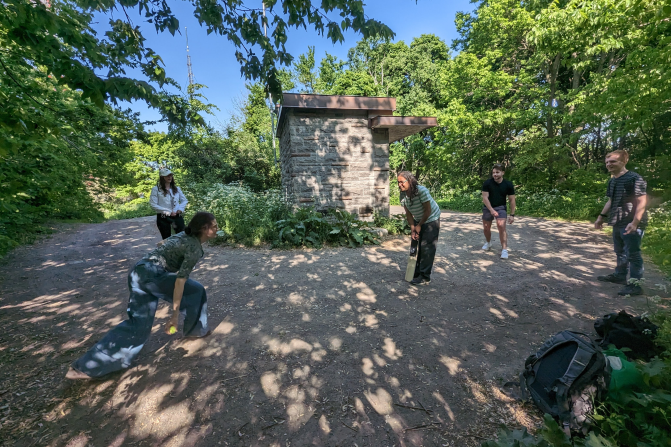{fig-alt="lab2"}

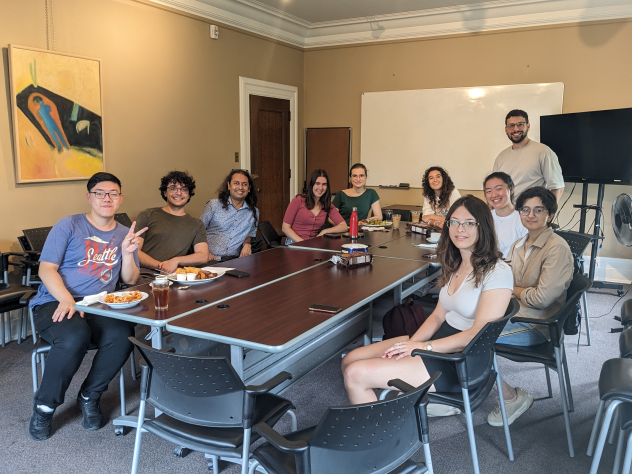{fig-alt="lab2"}

{fig-alt="lab2"}

:::
